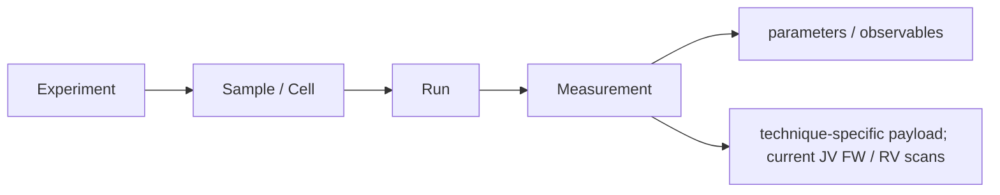
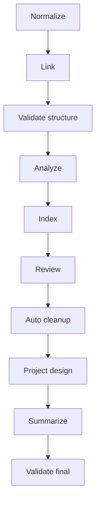

# LabFlow POC specification

## 1. Objective

LabFlow converts a researcher-supplied laboratory archive into one inspectable scientific aggregate with deterministic Results, minimal review burden, explicit Design reconstruction, optional AI assistance, reusable lab references, and deterministic export preparation.

A successful import and deterministic analysis must not depend on network access or AI availability.

## 2. Product principles

- **Local first:** scientific state, parsing, analysis, validation and export preparation run in the browser.
- **Evidence preserving:** RAW bytes and source paths remain immutable.
- **One scientific truth:** `ExperimentData` is the only mutable scientific aggregate.
- **Deterministic by default:** anything mechanically provable is handled without AI.
- **Human authority:** ambiguous semantics and AI proposals remain reviewable.
- **Traceable extension:** each cross-module structure declares an owner and persistence class.

## 3. Workspace and scientific Process

LabFlow uses the product hierarchy **User → Workspace → Process → Experiment**. Workspace is browser-local scientific context, not a second experiment database. It contains institution, role-based responsibilities, test locations, normal storage descriptors and reusable Process definitions.

A scientific Process describes a data-generating workflow (measurement, characterization, simulation, fabrication or other) and can declare sample types, controlled variables, observables, typical frequency/output size/capacity, metadata/linkage policy and stable references to Cabinet instruments, acquisition software, setups and file formats.

This Process is distinct from the per-device fabrication `Design.process`. Experiments bind to the reusable context through `meta.workspaceId` and `meta.processId`.

## 4. Scientific model

Canonical acquisition hierarchy:

`DomainSchema` defines record/root contracts. `DataModel` owns aggregate mechanics. `DataContracts` validates graph invariants. `DerivedState` owns recomputable projection invalidation. `ActionData` is the only persisted Action-output store.

## 5. Deterministic lifecycle

The current pipeline is:

Requirements:

- canonical naming and hierarchy reconstruction are deterministic;
- structural validation fails closed before dependent scientific calculations;
- JV metrics, ranking, quality state and summaries are deterministic;
- mechanically safe corrections may be detected automatically but require explicit acceptance before mutation;
- applied corrections carry provenance and trigger deterministic refresh;
- semantic uncertainty is represented as a finding/ambiguity rather than guessed;
- pipeline code never invokes an AI provider.

## 6. Review

Review exists for decisions, not for exposing parser internals. It must:

- distinguish deterministic cleanup from semantic ambiguity;
- show enough evidence to make each decision traceable;
- allow safe corrections to be accepted explicitly;
- allow AI only as a proposal mechanism for unresolved semantics;
- preserve individual override/rejection paths;
- permit clean datasets to proceed without unnecessary clicks.

## 7. Results

Results are derived exclusively from LabFlow Data and preserve JV semantics including FW/RV scans, core metrics, hysteresis, per-sample best measurement, group/experiment summaries, deterministic eligibility/quality state and raw curves when present.

AI may interpret or compare deterministic Results but may not replace or recalculate authoritative measurements.

## 8. Design and Cabinet

Design is experiment-owned scientific state. `DesignModel` is its write owner.

Lab Cabinet stores reusable laboratory references such as formulations, device stacks, fabrication recipes, materials, substrates, instruments, acquisition software, setups and file-format profiles. Cabinet is not inventory, a LIMS, or a second experiment model. Applying a Cabinet item copies a detached snapshot into Design and records the Cabinet source reference.

Cabinet content may be supplied as optional context to `design.infer`; reuse context is never evidence that an experiment actually used that recipe or device definition. `design.infer` prefers a useful reviewable proposal using experiment evidence, Cabinet context, domain-targeted Knowledge Base references and then cautious qualitative model inference. `unresolved_domains` is used only when no coherent review candidate remains. Once the researcher accepts such an unresolved domain, LabFlow persists it as a reviewed known unknown: scientific incompleteness remains explicit, while workflow completeness prevents the same domain from being requested repeatedly unless it changes.

## 9. Knowledge Base

The KB consists of a bundled baseline plus a browser-local editable JSONL overlay. Each entry is validated and can carry sources, facts, cautions, aliases and relations.

The KB is reference knowledge. Assistant/Actions may retrieve bounded active entries, but experiment evidence always takes precedence. Assistant prose relying on KB entries uses explicit `[KB:<id>]` references that the UI resolves to stored sources. `design.infer` retrieves short domain-targeted KB subsets for missing solutions/stack/process fields and marks KB-backed proposal items as `knowledge_reference` with exact `KB:<id>` evidence; those items remain review-only.

## 10. Action catalog

Current public Actions:

| Action | Target | Semantic result | State effect |
|---|---|---|---|
| `dataset.resolve-ambiguities` | unresolved review ambiguity | correction proposal | stores proposal |
| `design.infer` | one incomplete design experiment | qualitative Design proposal | stores proposal |
| `results.interpret` | deterministic Results | interpretation | stores annotation |
| `results.compare` | selected Results groups | comparison | stores annotation |
| `assistant.chat` | bounded page/experiment context | text answer | read-only |

Normalization, analysis, indexing, validation, safe cleanup and export remain deterministic services rather than Actions.

## 11. Action contract

Each public Action declares target, context profile/scope, result format/schema, effect, guards, execution steps and UI metadata in `actions/<id>/action.json`.

`ActionCapabilities` resolves bindings and guards before provider work. The Runner re-checks the same contract at execution time. Page routes influence recommendation only.

AI structured output must satisfy the declared schema and semantic validators before it can be stored.

## 12. Assistant

The Assistant is a read-only conversational surface over bounded page/experiment context, Action capability metadata, bounded Action outputs, Cabinet context when relevant, and validated KB references. It may recommend Actions but must not claim an Action executed unless LabFlow actually ran it.

## 13. AI/provider boundary

Providers are contacted directly from the browser using the configured endpoint. No hidden relay/fallback may change the request path. Provider/model configuration stays in the transport layer rather than scientific context.

Provider failures, browser/CORS failures and model-output validation failures remain distinct diagnostic categories.

## 14. Export and NOMAD

Export is a deterministic projection of validated current state. Portable saves include a redacted Workspace snapshot when available. NOMAD mapping/package generation is local and deterministic and carries stable Workspace/Process identifiers plus generic measurement technique metadata alongside optional JV metrics. The current direct-upload control is explicitly a non-networking stub until a real connector exists.

## 15. Extensibility

A new cross-module feature must declare:

- owner and mutation API;
- persistence class;
- dependency direction;
- invalidation rules for derived state;
- Action contract if researcher-facing;
- structure-catalog metadata when the shape crosses module boundaries;
- tests proving the new boundary.

Frameworks or abstraction layers are introduced only when they remove demonstrated duplication or make an invariant enforceable.

## 16. Release acceptance

A distributable release must pass `./release_check.sh`. Private real-dataset integration checks and browser automation are additional gates when their fixtures/environment are available.

### Conservative Design coverage fallback

For `design.infer`, a syntactically valid response does not fail merely because a required Design domain was omitted or represented by an unusable partial candidate. LabFlow owns the deterministic requested-domain scope: after normalization, any required domain that is neither usefully populated nor explicitly unresolved is deterministically downgraded to an auditable unresolved known-unknown. Incomplete candidate content for that domain is discarded so it cannot be applied accidentally. This fallback adds no scientific facts and is intended to make small and large models behave consistently without encouraging fabrication.

## 16. Design inference authority and confidence

`design.infer` must remain useful when direct Design evidence is sparse without silently fabricating certainty. Its source order is:

1. current experiment evidence;
2. compatible validated Lab Cabinet resources;
3. domain-targeted active Knowledge Base entries with structured `design_hint` where available;
4. cautious qualitative model inference;
5. explicit unresolved known unknown.

The model proposes; LabFlow owns provenance verification, normalization, semantic coverage, deterministic reference fallback, confidence calibration and application. A missing model field is therefore not automatically an empty result: if a validated Cabinet candidate or structured KB hint can responsibly fill the domain as a **review candidate**, the runtime may materialize it with its exact source marker. This fallback may never invent unsupported exact quantities.

Design items expose their choice nature through `provenance_kind` / `selection_basis`. Cabinet references use `CABINET:<id>` evidence and KB references use `KB:<id>` evidence. IDs are verified; an invalid reference is downgraded rather than granted false authority.

Confidence is provenance-calibrated candidate suitability, not proof of experiment use. Source nature dominates model self-confidence and unsupported quantitative values are capped conservatively. Cabinet and KB candidates remain review-only. See `docs/guides/DESIGN_INFERENCE.md` for the executable semantics.
