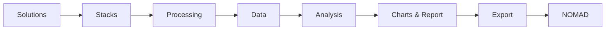
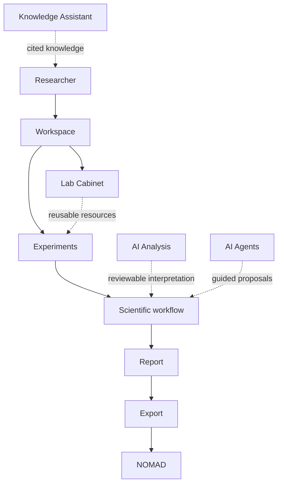
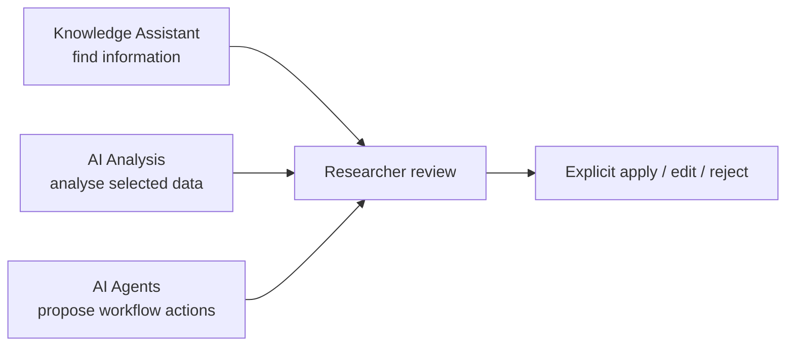
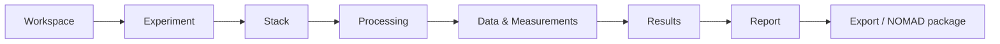

# LabFlow

> An AI-ready laboratory workflow platform that helps researchers turn experimental work into structured, reusable and NOMAD-ready scientific records.

**Static proof of concept · Perovskite Research Lab · No backend · No external services**

[Open the workspace](index.html) · [Read the user manual](documentation.html) · [Explore the UI Kit](ui-kit.html) · [Review the architecture](docs/ARCHITECTURE.md)

---

## The laboratory workflow is the product

LabFlow explores a simple question:

> Can a researcher document an experiment as part of doing the work—not as a separate repository task at the end?

The interface starts with familiar laboratory decisions: prepare solutions, build material stacks, record processing, add data, interpret results and prepare a report. Structured records, provenance, AI context and NOMAD mappings grow behind that workflow.



The current POC validates one workflow. It intentionally does not invent additional experiment types before researchers have tested this path.

## Why LabFlow

Laboratory information is often split across notebooks, instrument files, spreadsheets, shared drives, personal conventions and repository forms. This creates repeated typing and weakens the link between a scientific result and the work that produced it.

LabFlow keeps those relationships visible:

| Researcher need | LabFlow response |
| --- | --- |
| Reuse a known solvent, protocol or instrument | Search the shared **Lab Cabinet** |
| Compare material structures | Keep multiple **stacks** inside one experiment |
| Preserve what actually happened | Separate reusable **protocols** from recorded **processing** |
| Understand a result later | Link data, measurements, files and provenance |
| Use AI without hiding uncertainty | Show scope, evidence, confidence and approval |
| Prepare interoperable records | Validate exports before the final **NOMAD** step |

## One coherent system



Projects remain available as optional containers for related experiments. They are not required to begin work.

## Design principles

- **Workflow-first** — the primary navigation follows what researchers do.
- **Researcher-first** — laboratory language appears before data-model terminology.
- **Progressive complexity** — essential fields come first; variants and advanced planning appear only when needed.
- **Reusable resources** — shared definitions reduce repeated entry.
- **Concrete evidence** — experiment-owned snapshots preserve what was actually used.
- **Reproducibility and provenance** — results remain linked to processing, measurements and original files.
- **Human-in-the-loop AI** — AI proposes; researchers inspect, edit, accept or reject.
- **NOMAD interoperability** — export readiness is collected progressively and validated explicitly.

## Lab Cabinet

The Lab Cabinet is the searchable shared resource space for the laboratory.

```text
Workspace
└── Lab Cabinet
    ├── Materials and substances
    ├── Solution recipes and prepared batches
    ├── Substrates and stack templates
    ├── Equipment
    ├── Conditions
    ├── Protocols
    └── Reusable actions
```

An experiment links a resource and retains a usage snapshot. Editing the shared definition later must not silently rewrite historical evidence.

## AI-ready by design

LabFlow separates three purposes that are often collapsed into one generic assistant.

| Capability | Job | Control boundary |
| --- | --- | --- |
| **Knowledge Assistant** | Find and verify shared laboratory knowledge | Answers cite sources and flag conflicts or insufficient evidence |
| **AI Analysis** | Interpret selected experimental data | Original measurements remain authoritative |
| **AI Agents** | Guide bounded multi-step workflows | Every proposed action passes through approval |



These interfaces are credible simulations. The repository contains no LLM, embeddings, vector database or autonomous agent runtime.

## Scientific data model

The central distinction is between a reusable definition and its concrete experimental use.

| Shared Lab Cabinet definition | Experiment-owned record |
| --- | --- |
| Solution recipe | Prepared solution batch |
| Stack template | Experiment stack |
| Protocol | Processing run |
| Reusable action | Executed action |
| Instrument | Instrument use and actual settings |
| Material or substance | Lot or recorded use |



See [Data Model](docs/DATA_MODEL.md) for records, ownership and provenance rules.

## NOMAD integration

NOMAD is the final explicit stage—not a scattered download button.

```text
Report → Export review → Prepare NOMAD → Send through NOMAD API
```

The POC demonstrates local package generation, readiness checks, metadata warnings, a simulated personal API connection and a separate NOMAD import path. It never sends a network request.

## What you can explore

- Workspace with recommended next actions
- Three-step experiment creation
- Solution recipe and physical batch preparation
- Multi-stack experiment management and optional variants
- Protocol definition versus recorded processing
- Common file import and manual data entry
- Sample, measurement and result comparison
- Local chart and scientific utility tools
- Editable reports and browser-generated exports
- NOMAD package, import and API simulations
- Shared evidence-linked Knowledge Assistant
- AI Analysis and controlled AI Agents
- User Settings, Admin Settings, Documentation and UI Kit

## Current scenario

Every principal demonstration uses one coherent laboratory story:

| Context | Demo record |
| --- | --- |
| Laboratory | Perovskite Research Lab |
| Experiment | `PSC-2026-041` |
| Solution | `FA–Cs 1.2 M` · `SOL-081` · DMF/DMSO |
| Stacks | `S01` and `S02` |
| Equipment | Spin Coater 01 |
| Protocol | PSC n-i-p standard · v4.1 |
| Output | Editable report and NOMAD export |

## Why a static prototype

The absence of a backend is deliberate. Before investing in production infrastructure, this repository tests:

- whether the workflow matches laboratory practice;
- whether researchers understand each record;
- whether progressive disclosure keeps the interface usable;
- whether the data model supports provenance and interoperability;
- where AI assistance is useful and where human review is essential;
- whether NOMAD preparation can feel like a natural final step.

The POC has **no backend, authentication, authorization, database, shared persistence, file storage, real AI or real NOMAD connection**. Visible accounts, API keys, retrieval, agent runs and external submissions are simulations.

## Architecture

```text
Static HTML pages
       │
       ├── assets/theme.css      design tokens and themes
       ├── assets/app.css        shared layout and components
       ├── assets/app.js         shell, demo state and interactions
       └── assets/exporters.js   local browser-generated files
```

- Plain semantic HTML, CSS and JavaScript
- No framework or build step
- No CDN dependency
- Relative URLs compatible with GitHub Pages
- Demo state stored in memory or `localStorage` where stated

## Run locally

```sh
python3 -m http.server 8765
```

Open `http://127.0.0.1:8765/`.

## Repository map

| Path | Purpose |
| --- | --- |
| `index.html` | Workspace and primary researcher actions |
| `experiment.html` | Standard eight-phase experiment workflow |
| `catalogs.html` | Search-first Lab Cabinet |
| `workspace.html` | Data, measurements and comparisons |
| `report.html` | Report, export and NOMAD preparation |
| `knowledge.html` | Shared Knowledge Assistant |
| `ai-assistant.html` | AI Analysis and AI Agents |
| `editors.html` | Laboratory tools |
| `documentation.html` | In-app user manual |
| `ui-kit.html` | Canonical interface components |
| `docs/` | Focused product and technical references |

## Documentation

| Guide | Audience |
| --- | --- |
| [User manual](documentation.html) | Researchers and evaluators |
| [Researcher workflow](docs/WORKFLOW.md) | Researchers and product collaborators |
| [Architecture](docs/ARCHITECTURE.md) | Developers and technical reviewers |
| [Data model](docs/DATA_MODEL.md) | Scientific data and backend designers |
| [AI architecture](docs/AI_ARCHITECTURE.md) | AI, product and safety reviewers |
| [Tools, exports and NOMAD](docs/TOOLS_EXPORTS_NOMAD.md) | Integration and interoperability reviewers |
| [Design system](docs/DESIGN_SYSTEM.md) | UI contributors |
| [Responsive behaviour and limits](docs/RESPONSIVE_AND_LIMITS.md) | Developers and QA |
| [Glossary](docs/GLOSSARY.md) | Everyone |

## Status and roadmap

### Implemented in the static POC

- Complete navigable interface
- Coherent perovskite demonstration data
- Browser-side interactions and selected local exports
- Responsive desktop and mobile layouts
- Human-controlled AI and NOMAD simulations

### Future production work

1. Validate the workflow with laboratory researchers.
2. Refine domain records and NOMAD mappings from feedback.
3. Design authentication, permissions and workspace governance.
4. Add durable storage, file integrity and audit history.
5. Implement secure NOMAD import and submission services.
6. Evaluate real retrieval, models and agent tools with permission boundaries.
7. Add automated accessibility, integration and scientific validation tests.

## Screenshots

| Workspace | Experiment workflow | Knowledge Assistant |
| --- | --- | --- |
| _Screenshot placeholder_ | _Screenshot placeholder_ | _Screenshot placeholder_ |

Screenshots are intentionally left as replaceable placeholders until the researcher validation flow stabilises.

## Limitations

Do not use this repository to store sensitive laboratory data or real API keys. Browser-generated exports demonstrate interaction and structure; they are not guarantees of scientific correctness, regulatory compliance or NOMAD acceptance.

## License

No license file is currently included. Add an explicit license before distributing or accepting external contributions.
