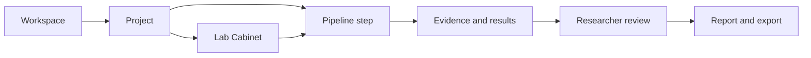

# LabFlow

LabFlow is a static research workspace designed by **Matteo Ginesi** to make laboratory projects easier to plan, inspect, compare and report. The proof of concept runs from checked-in HTML, CSS and JavaScript, uses no CDN, sends no automatic request and retains no browser state after reload.

It is an interactive product showcase, not a production application. It demonstrates the information model, reusable interface blocks, scientific review patterns and export contracts with a small checked-in dataset. It does not contain a server, database, real authentication, connected AI provider, remote upload or collaboration infrastructure.

## What the product demonstrates

LabFlow joins work that is usually scattered across notes, spreadsheets and isolated tools:

- a workspace containing multiple research projects;
- reusable pipelines with revisitable, state-aware steps;
- a Lab Cabinet for materials, solutions, stacks, mappings and analyses;
- structured Solution and Stack Builder/Review interfaces;
- Smart Import with explicit field mapping, units and provenance;
- deterministic analysis, validation and comparison views;
- Ask LabFlow for evidence-led questions, inspection and action previews;
- local TXT, Markdown, LaTeX, YAML, JSON, spreadsheet, DOCX and diagram tools;
- a native downloadable PDF generated from the current Report Composer state, a professionally formatted editable DOCX, a ten-sheet formula-driven XLSX workbook and transparent ZIP packages;
- a non-transmitting NOMAD readiness preview.



The included CHOSE scenario follows a mixed-cation perovskite campaign through solution preparation, device stack definition, experiment records, JV ingestion, analysis and reporting. A shorter measurement-review pipeline demonstrates that the shared shell and scientific components are reusable.

## Product principles

Evidence remains visible. LabFlow distinguishes raw measurements, calculated results, researcher statements, validation findings and AI suggestions. Suggested actions are previews until a person confirms them; confidence describes source matching and never replaces scientific judgement.

Privacy is structural. Mutable state exists only in JavaScript memory. Reload restores checked-in defaults. The application uses no cookies, browser persistence, service workers, trackers, telemetry or network-backed search. Demonstration credentials are never retained or included in exports.

The interface uses a dark laboratory shell around light content by default. Theme, palette and density travel only in internal navigation parameters, and are applied before the stylesheet to avoid cross-page flicker. Typography uses the operating system’s local UI font stack; icons and diagrams are inline SVG assets rendered locally.

## Explore the POC

Open `index.html` in a modern browser. The checked-in bundles allow direct local use without installing dependencies or starting a service.

Each root entry page already contains the shared sidebar, topbar and content shell, so the first document is useful before JavaScript renders page-specific content. An optional repository maintenance helper keeps those eight static entry documents aligned; running it is never required to open or use the POC.

A useful walkthrough is:

1. Open Workspace and enter `PRJ-2026-014`.
2. Review the pipeline context, Solution Builder and Stack Builder.
3. Inspect Smart Import and the deterministic data-quality issues.
4. Ask a relationship question in Ask LabFlow and inspect its evidence graph.
5. Open Tools, render a workflow in Diagram Studio and download the SVG.
6. Review the report, XLSX structure and local export package.

Keyboard users can open global search with `Ctrl+K` or `Cmd+K`, move through results with the arrow keys, confirm with Enter and close with Escape.

## Configuration and checked-in sources

`settings.yaml` is the canonical configuration source. `pipelines/` contains canonical workflow definitions. Documentation and both kinds of YAML have checked-in browser snapshots so the application remains request-free when opened from disk. When a canonical source changes, refresh its corresponding snapshot and complete the validation checklist.

For static hosting, the root pages load one checked-in CSS bundle and one small shared runtime bundle instead of requesting every source file separately. The readable files under `ui/` and `assets/js/` remain canonical; run `python tools/build_frontend_bundles.py` after changing shared CSS, settings, data, pipelines, exporters or volatile state. No build step is required to open or deploy the already checked-in POC.

`examples/` is intentionally retained. It contains a standalone theme integration page and inspectable sample export packages used to verify that generated artifacts remain understandable outside the application.

## How the POC is organised

The runtime follows one deliberately small boundary:

```text
checked-in demo records
        ↓
small data access functions
        ↓
shared render blocks and page interactions
```

`assets/js/data.js` owns the illustrative records and exposes `LabFlowDataSource` for common lookups. Rendering code does not need to know how a future source obtains the same stable entities. This is only a replacement seam and does not imply connected or speculative infrastructure.

The essential directories are:

- `assets/js/` — demo data, in-memory state, shared rendering, focused Tools/Knowledge modules, diagrams and local exporters;
- `ui/` — semantic theme tokens, theme variants, shared components and responsive layout;
- `pipelines/` — canonical workflow definitions, not page templates;
- `docs/` — the small set of canonical product, UI, data, assistant/export and validation documents;
- `examples/` — standalone theme and export fixtures used for inspection;
- root HTML files — complete static entry points with the shared shell already checked in.

The UI Kit is the visual source of truth. A block belongs there only when the application uses it; shared blocks should be extended before page-specific CSS is introduced.

## Documentation

- [Project model and architecture](docs/PROJECT.md)
- [UI and interaction guidelines](docs/UI_UX_GUIDELINES.md)
- [Pipelines, records and provenance](docs/PIPELINES_AND_DATA.md)
- [Lab Assistant, diagrams, reports and export](docs/AI_REPORTS_AND_EXPORT.md)
- [Theme integration](docs/THEME_INTEGRATION.md)
- [Validation checklist](docs/VALIDATION_CHECKLIST.md)
- Example artifacts are described inside the retained `examples/` package.

## Status and authorship

LabFlow is a non-production proof of concept. Its records, identities, scientific values and integrations are illustrative. Product concept, direction and authorship: **Matteo Ginesi**.
