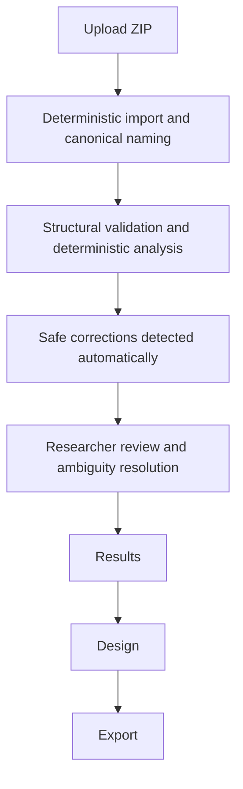
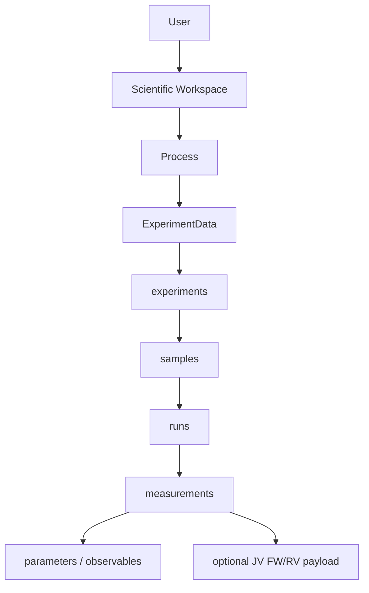
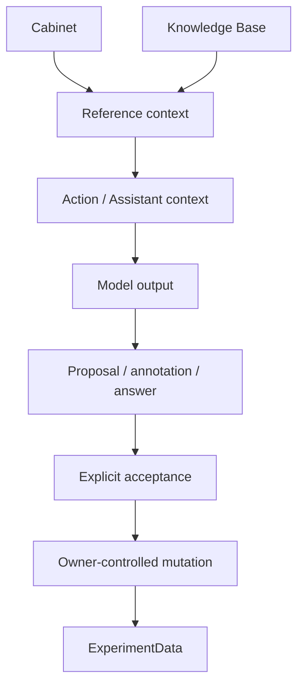

# LabFlow

LabFlow is a local-first browser application for turning laboratory archives into an inspectable scientific data model, deterministic analysis, reviewable experiment Design, optional AI assistance, and deterministic export packages.

The project is intentionally small: vanilla JavaScript, local CSS, static assets, and no application backend. Extensibility comes from explicit ownership contracts and registries rather than framework layers.

## What LabFlow guarantees

Four invariants define the product:

1. **RAW input is immutable evidence.** Uploaded archive bytes and source paths are never rewritten by cleanup or AI.
2. **`ExperimentData` is the only mutable scientific aggregate.** Features may project or index it, but may not create a parallel editable scientific model.
3. **Deterministic work stays deterministic.** Parsing, normalization, linking, JV analysis, validation, safe-cleanup detection, summaries, and export preparation never require an AI provider.
4. **AI output is non-authoritative until explicitly accepted.** AI may propose, interpret, compare, or answer; it does not silently alter scientific truth.

These are executable constraints, not only documentation. The release validators and unit tests enforce the main ownership boundaries.

## Research workflow



A clean archive can proceed directly to Results. AI availability is never a prerequisite for import or analysis.

## Scientific state

The product model is:



`DomainSchema` owns record shapes and persistence metadata. `DataModel` owns aggregate mechanics. `DataPipeline` owns deterministic refresh. `ActionData` owns persisted Action proposals and annotations. Workspace/Process, Cabinet and Knowledge Base are separate reference/context sources, not measurement evidence. Workspace describes institution, responsibilities and the normal data-generating setup; Process definitions reference reusable Cabinet infrastructure.

## Cabinet, Knowledge Base, AI, Actions, Assistant

The cross-feature flow is deliberately one-way with explicit authority boundaries:



Cabinet reuse writes Design only through `DesignModel` and copies detached snapshots. KB entries are cited reference knowledge. Action execution is governed by Action manifests and `ActionCapabilities`. The Assistant is read-only with respect to scientific state.

## Repository map

```mermaid
flowchart TD
    ROOT[LabFlow repository] --> EXP[assets/js/experiment: canonical model and schema]
    ROOT --> DATA[assets/js/data: import, parsing and pipeline]
    ROOT --> CAB[assets/js/cabinet: reusable lab references]
    ROOT --> KB[assets/js/knowledge: JSONL knowledge]
    ROOT --> AI[assets/js/ai: providers, Actions and Assistant]
    ROOT --> PAGES[assets/js/pages: route renderers]
    ROOT --> UI[assets/js/ui: shared UI primitives]
    ROOT --> ACT[actions: manifests, prompts and schemas]
    ROOT --> PROMPTS[prompts: deterministic and AI policies]
    ROOT --> KNOW[knowledge: bundled KB]
    ROOT --> DOCS[docs: canonical documentation]
    ROOT --> TOOLS[tools: builders and validators]
    ROOT --> TESTS[tests: unit and browser regression]
```



Generated JavaScript bundles are build artifacts. Edit their source Markdown/JSONL/manifest files and rebuild them; do not patch generated output by hand.

## Runtime introspection

From browser DevTools:

```js
LabFlow.Data.help()
LabFlow.Data.summary()
LabFlow.Data.tree()
LabFlow.Data.validate()
LabFlow.Data.pipeline()
LabFlow.Data.actions()
LabFlow.Data.contracts()
LabFlow.Data.structures()
```

`LabFlow.Data.structures()` exposes the cross-module structure catalog: owner, layer, persistence class, required fields, and descriptive field metadata. It is documentation over the real owner contracts, not another store.

## Run locally

```bash
python3 -m http.server 8000 --bind 127.0.0.1
```

Open `http://127.0.0.1:8000/`. Do not browse to `0.0.0.0`; it is a bind address, not a client address.

For a local OpenAI-compatible llama.cpp server, `labflow_engine.sh` provides the supported launcher and diagnostics. It binds to loopback by default and requires an explicit `--lan` opt-in for LAN exposure.

## AI providers

LabFlow calls the endpoint configured in Settings directly from the browser. There is no hidden provider relay or backend fallback. Browser CORS, authentication, quota, model, and server errors therefore remain distinguishable.

OpenRouter (`openrouter/free`) is the static-POC default because it is compatible with the browser-only deployment model. Local OpenAI-compatible endpoints remain supported through provider adapters.

Use:

```js
LabFlow.AIConsole.help()
```

for provider/model diagnostics without experiment data.

## Build and verification

The release gate is the preferred command:

```bash
./release_check.sh
```

For individual checks, see `docs/VALIDATION.md`. Relevant generated artifacts are rebuilt with:

```bash
python tools/build_prompt_bundle.py
python tools/build_knowledge_bundle.py
python tools/build_action_registry.py
python tools/build_action_reference.py
python tools/build_docs_bundle.py
python tools/build_ui_kit_inline.py
```

## Documentation entry points

Start with:

- `docs/README.md` — documentation map;
- `docs/ARCHITECTURE.md` — authoritative ownership and dependency boundaries;
- `docs/specs/DATA_MODEL.md` — scientific aggregate and persistence contract;
- `docs/specs/PIPELINE.md` — deterministic lifecycle;
- `docs/specs/ACTIONS.md` — Action contract and execution semantics;
- `docs/guides/EXTENDING_LABFLOW.md` — extension recipes;
- `docs/CONTRIBUTING.md` — change discipline and review expectations;
- `docs/CODE_REVIEW.md` — reviewer-oriented checklist.

## Current scope

This repository is a proof-of-concept, not a production LIMS. It deliberately avoids inventory management, remote multi-user synchronization, hidden server state, and automatic scientific claims that cannot be traced to source evidence or an explicit researcher decision.
