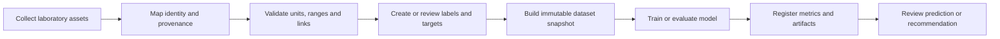

# AI, machine learning, deep learning and Vision foundation

LabFlow treats AI readiness as a consequence of ordinary laboratory work. Researchers continue to use **Workspace → Project → Process → Experiment**; LabFlow captures stable identifiers, units, provenance, files, transformations, labels and outcomes behind that workflow.

The current implementation is a static proof of concept. It performs no real training, inference, upload or remote request. Its purpose is to make the future contracts and user experience concrete before a backend or ML platform exists.

## Product boundary

The AI & Models workspace contains six connected but distinct areas:

1. **Knowledge** — the existing assistant and evidence-led RAG demonstration.
2. **Data & datasets** — laboratory data collection, validation, labeling, dataset browsing and immutable snapshots.
3. **ML / training** — model registry, reproducible runs, metrics, diagnostics and artifacts.
4. **Vision** — optical, PL, EL and microscopy ingestion, annotation, classification and segmentation review.
5. **Scientific AI** — quality detection, stability forecasting, reproducibility monitoring and experiment optimization.
6. **Predictions** — model outputs, uncertainty, applicability and human review.

These sections do not replace the project workflow. They expose what the normal project workflow is already producing and how those records may later support connected services.

## End-to-end data lifecycle



The POC shows this lifecycle as a lightweight laboratory MLOps surface. It deliberately avoids infrastructure concepts that would not help a researcher understand the data.

## Data sources and modalities

A future connected LabFlow should collect four broad modalities through the same project and experiment records:

| Modality | Examples | Required linkage |
|---|---|---|
| Structured process data | solution composition, stack, deposition, annealing, environment | project, experiment, sample, process snapshot, material lot |
| Electrical measurements | JV, stabilized output, Voc, Jsc, FF, PCE | sample, device, instrument, calibration, acquisition time |
| Spectra and time series | UV–Vis, PL, EQE, impedance, aging trajectory | sample, instrument, processing version, time or wavelength axis |
| Scientific images | optical, PL map, EL, microscopy, thermal image | sample or module, acquisition session, calibration, modality |

Raw files remain immutable. Parsed values, normalized fields, derived features, labels and model-ready tensors are separate objects linked back to the original source.

## Core AI-ready records

| Record | Purpose | Minimum provenance |
|---|---|---|
| Data source | Original form, instrument file, image or stream | source ID, timestamp, instrument or author, checksum |
| Parsed record | Machine-readable representation of a source | parser and version, mapping, warnings |
| Transformation | Deterministic processing step | input, output, parameters, code version |
| Feature | Model input | name, type, unit, source, transformation |
| Label or target | Reviewed outcome for learning | value, unit, origin, reviewer, state |
| Annotation | Image class, region or pixel mask | image, label schema, reviewer, version |
| Dataset snapshot | Immutable rows, schema, filters and split | sources, exclusions, groups, creator, time, version |
| Model | Stable task and input/output contract | family, algorithm, schema, owner |
| Training run | One execution | model, snapshot, split, seed, environment, logs |
| Artifact | Serialized model, metrics or report | run, file hash, format, creation time |
| Prediction | Versioned model output | model version, dataset context, inputs, uncertainty |
| Human review | Acceptance, rejection or revision | reviewer, decision, timestamp, note |

## Dataset Studio contract

The Data & Datasets view demonstrates one active multimodal working cohort. It includes:

- record, experiment, measurement, image, feature, target and storage counts;
- collection-to-training lifecycle stages;
- modality coverage;
- deterministic quality gates;
- annotation and target queue;
- dataset row browser with train, validation, test, holdout and review states;
- feature, target and grouping schema;
- immutable snapshot history.

A future Dataset Builder should let a researcher select projects, experiments, samples and modalities, then define inclusion rules, features, targets, groups and exclusions. The output is always an immutable snapshot with a stable ID and version.

A snapshot must record:

- source projects, experiments, samples and assets;
- schema and explicit units;
- feature and target definitions;
- selection and exclusion rules;
- missing-value policy;
- transformations and versions;
- grouping and split policy;
- leakage checks;
- label schema and annotation state;
- creator, timestamp and manifest hash.

## Quality and leakage prevention

Quality checks should be deterministic whenever possible. The POC demonstrates:

- unit and dimensional validation;
- entity and provenance links;
- duplicate and near-duplicate detection;
- scientific range checks;
- target completeness;
- reviewed labels;
- experiment- and batch-grouped splits.

Future checks should also cover instrument drift, acquisition-session bias, repeated images, category sparsity, target leakage, temporal leakage, laboratory bias and out-of-domain inputs.

## Model families shown in the POC

The registry is organized around useful laboratory tasks rather than fashionable architectures:

- **PCE regression** using an interpretable gradient-boosting baseline;
- **T80 forecasting** using a probabilistic model with uncertainty and censored outcomes;
- **process anomaly detection** using deterministic rules plus an unsupervised baseline;
- **film-defect segmentation** using a compact U-Net demonstration;
- **defect triage classification** using a compact CNN;
- **next-experiment ranking** using Gaussian-process Bayesian optimization.

Simple statistical and ML baselines should be established before deep learning. DL is justified primarily for images, large spectra, long time series or genuinely multimodal inputs.

## Training-run contract

A model definition and a training run are separate records. Every run retains:

- model ID and version;
- dataset snapshot ID and version;
- preprocessing manifest;
- grouping and split strategy;
- random seed;
- parameters;
- code and environment version;
- hardware description;
- training and validation history;
- metrics and diagnostics;
- artifact references;
- review state.

Regression evaluation should include MAE, RMSE, R², grouped cross-validation and residual inspection. Classification should include class balance, precision, recall, F1, confusion matrix and grouped validation. Segmentation should include Dice, mean IoU, precision, recall and representative overlays.

## Scientific Vision contract

The Vision section demonstrates the future flow:


Potential CHOSE-oriented uses include:

- film uniformity, streaks, pinholes and aggregation;
- PL non-uniformity;
- EL inactive regions and shunts;
- P1/P2/P3 scribing defects;
- microcracks and flexible-module damage;
- edge delamination and incomplete coverage.

Images and masks remain distinct. Model masks are never silently promoted to reviewed annotations.

## Stability forecasting

A stability model may consume:

- stack, materials, lots and encapsulation;
- initial electrical and optical descriptors;
- stress protocol and environmental conditions;
- timestamped performance trajectory;
- T80/T90 or censored endpoint;
- reviewed failure mechanism.

The interface must show observed data, forecast, uncertainty interval, target definition and applicability together. A forecast is not an experimental measurement.

## Experiment optimization

The Scientific AI section demonstrates offline Bayesian ranking of candidate experiments. A candidate includes:

- proposed variable values;
- fixed parameters and constraints;
- objective or acquisition rationale;
- expected information gain or improvement;
- uncertainty;
- feasibility and risk;
- source dataset and model version.

The model ranks candidates; the researcher decides whether a candidate is scientifically sensible, safe and feasible.

## Scientific output classes

LabFlow keeps these states separate in storage, interface and export:

```text
Raw measurement
Validated measurement
Processed measurement
Calculated result
Reviewed annotation
Model prediction
Model-generated mask
Experiment recommendation
LLM or RAG suggestion
Researcher statement
Approved conclusion
```

No model output is silently written into a measured-result or approved-conclusion field.

## Future service boundary

The browser should not depend directly on a particular ML framework. A future backend may implement a small set of product-oriented operations:

```text
collect
parse
validate
annotate
build_dataset
snapshot
train
evaluate
predict
rank_experiments
review
```

The static POC demonstrates the input, output and review contracts for those operations without pretending that the infrastructure already exists.

## Recommended implementation sequence

1. Complete identifiers, units, provenance, file relationships and raw/processed/derived separation.
2. Implement deterministic validation and dataset manifests.
3. Add reviewed labels and image annotations.
4. Build immutable snapshots with leakage-safe groups and splits.
5. Train a simple tabular baseline and register runs and artifacts.
6. Add stability forecasting and anomaly detection.
7. Add Vision only after acquisition and annotation practices are stable.
8. Add offline experiment ranking before considering closed-loop automation.

This sequence keeps LabFlow useful as a laboratory application first, while making later AI work technically credible.

## Interface integration

The AI & Models workspace does not define a parallel visual system. Dataset, model, Vision and prediction views reuse the canonical LabFlow breadcrumb, page header, summary strip, tabs, panels, toolbars, dense tables, validation issues, notices, badges and responsive grids. Domain-specific visuals are limited to scientific plots and image previews inside ordinary panels.
## UI Kit alignment

The AI & Models workspace uses the shared product grammar rather than a separate AI visual identity. Summary strips, panels, dense tables, progress rows, metadata lists, notices, validation issues, badges and tabs must match their UI Kit examples exactly.

The only specialized renderers are:

- **training/evaluation charts** — local SVG, explicit axes, a textual legend, a visible demonstration-data label and no decorative dashboard frame;
- **scientific vision previews** — a local preview kept subordinate to source identity, proposed output, score, review state and the original evidence.

Readiness must be decomposed into inspectable checks. Do not use circular readiness gauges, gradient AI hero surfaces, glass effects, model “scoreboards” or generic illustrations that are absent from the UI Kit. Prediction, annotation proposal, deterministic result and researcher conclusion remain visually and semantically distinct.

