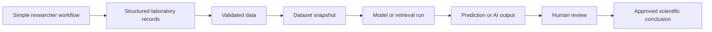
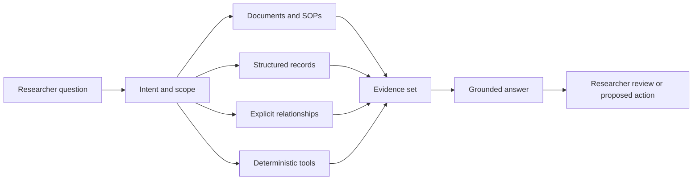

# AI and machine-learning foundation

LabFlow is designed around two product promises: laboratory work must remain simple for the researcher, and the same everyday work must produce data that can support trustworthy AI, machine learning and deep learning later. AI readiness is therefore a property of the core data model, not a collection of disconnected assistant buttons.

The current POC remains local and simulated. It does not train a model, call an LLM, create embeddings or connect to a vector database. It demonstrates the contracts, record types and review patterns that a future implementation can use without redesigning the researcher workflow.

## Product principle



The researcher continues to work through **Workspace → Project → Process → Experiment**. LabFlow captures identifiers, units, provenance, files and relationships behind that familiar flow. Future AI services consume those stable records rather than forcing the user to prepare a second, separate AI system.

## Shared AI-ready records

The future data layer should recognize the following records even when the first implementation stores them inside a larger project document:

| Record | Purpose | Minimum provenance |
|---|---|---|
| Data source | Original file, instrument stream, form or controlled document | source identifier, author/instrument, timestamp, checksum or version |
| Dataset snapshot | Immutable selection of rows, features, targets and exclusions | source projects, selection rules, schema, created time, version |
| Transformation | Deterministic change from one representation to another | input, output, operation, parameters, implementation version |
| Feature | Machine-readable model input | name, type, unit, source field, transformation |
| Label or target | Observed or reviewed outcome used for learning | value, unit, origin, reviewer and label state |
| Model | Stable conceptual model definition | task, algorithm, input schema, target and owner |
| Model version | Reproducible model artifact | model, dataset snapshot, parameters, code version and file hash |
| Training run | One execution of training or evaluation | dataset, split, seed, metrics, hardware, logs and artifacts |
| Prediction | Versioned model output for one record | model version, dataset/version context, inputs, uncertainty and applicability |
| AI output | LLM/RAG answer, suggestion or generated section | model, prompt, sources, tools, timestamp and limitations |
| Human review | Explicit acceptance, rejection or revision | reviewer, time, decision and note |

These records do not all require separate screens or database tables. They require stable semantics and exportable structures.

## Scientific data classes

LabFlow must keep the following classes separate in storage, interface and export:

```text
Raw measurement
Validated measurement
Processed measurement
Calculated result
Model prediction
LLM or RAG suggestion
Researcher statement
Approved conclusion
```

A prediction is never silently written into a measured-result field. A generated suggestion is never upgraded to a researcher conclusion without review. Every derived object points back to the exact data, transformation, model or source that produced it.

## Knowledge, LLM and RAG path

The Knowledge Assistant is the future entry point for document RAG, structured queries, Graph RAG and deterministic tools. The user chooses scope and asks a laboratory question; LabFlow chooses the retrieval method internally.



A useful answer record contains:

- answer text;
- search scope;
- model and prompt version;
- documents and structured records used;
- relationships traversed;
- deterministic calculations or tools executed;
- evidence locations;
- coverage or confidence information;
- limitations;
- proposed actions;
- human review state.

The POC includes a small RAG evaluation set with expected sources and unsupported-claim checks. A future connected implementation should measure retrieval coverage, citation correctness, unsupported claims and answer usefulness rather than relying on subjective demonstrations.

## Dataset Builder contract

The future Dataset Builder should let a researcher select projects, processes, experiments and samples, then choose input features and a target. It produces an immutable **Dataset Snapshot**, not a live query with no identity.

A snapshot records:

- stable dataset identifier and version;
- source projects and experiments;
- included and excluded rows;
- selection and quality filters;
- feature schema;
- target schema;
- explicit units;
- missing-value policy;
- group or split strategy;
- source and transformation versions;
- creator and timestamp.

The included `DS-PCE-001` demonstration shows eight samples, six candidate features, PCE as target and an experiment-grouped validation policy. It remains illustrative and is not evidence of a trained production model.

## Data readiness

AI readiness is explained through visible checks rather than one unexplained score. The POC currently shows:

- structured metadata;
- normalized units;
- provenance coverage;
- target completeness;
- governed knowledge coverage;
- blocking data-quality issues.

Future checks should also cover duplicated records, incompatible units, category sparsity, target leakage, repeated samples across train and test, instrument or laboratory bias, temporal drift and domain coverage.

## Model and training-run contract

Start with inspectable baselines before deep learning. Linear models, decision trees, random forests or gradient boosting can validate the data and evaluation flow before advanced architectures are justified.

A **Model** describes the task and intended input/output contract. A **Training Run** records one execution with a particular snapshot, split, seed, parameters and environment. Evaluation must include a simple baseline and a split that respects scientific grouping such as experiment, batch or time.

For regression, useful evidence includes MAE, RMSE, R², cross-validation, residual plots and performance by experiment or batch. For classification, include precision, recall, F1, confusion matrix, class balance and grouped validation. Metrics alone are insufficient without leakage checks and domain-of-applicability information.

## Prediction contract

A prediction record contains at least:

```yaml
id: PRD-S08-PCE-001
sample_id: S08
model_version: MDL-PCE-RF-001
training_dataset: DS-PCE-001
predicted_value: 20.8
unit: percent
uncertainty: 1.5
input_coverage: 0.93
observed_value: 21.28
review_state: reviewed
```

The interface presents predicted and observed values together, with uncertainty, input coverage, model version, dataset snapshot and review state. Missing inputs and applicability warnings remain visible.

## Future service boundary

The browser should not depend directly on Ollama, a specific vector database, PyTorch, TensorFlow or scikit-learn. Future infrastructure should implement a small set of product contracts:

```text
ask
retrieve
inspect
build_dataset
train
evaluate
predict
review
```

The current `LabFlowDataSource` remains a small replacement seam for records. A connected implementation may add explicit service boundaries later, but the static POC must not simulate remote APIs or introduce speculative infrastructure.

## POC surfaces

The **AI & Models** workspace contains four sections:

1. **Knowledge Assistant** — evidence-led questions, scope, citations and a RAG evaluation set.
2. **Datasets** — AI readiness, immutable snapshots, features, targets and quality.
3. **Models** — model registry, baseline metrics and training-run history.
4. **Predictions** — prediction review, uncertainty, applicability and scientific output classes.

The Project Analysis area also includes an **AI readiness** tab so the future capability remains contextual to the current project rather than becoming a separate technical product.

All controls remain non-persistent demonstrations. They show future contracts and do not create datasets, train models or perform inference.

## Development sequence

1. Complete identifiers, units, provenance, raw/processed/derived distinctions and evidence records.
2. Connect document and structured retrieval with citations and an evaluation set.
3. Implement Dataset Builder and immutable snapshots.
4. Train and evaluate a simple baseline model.
5. Add model registry, training runs, predictions and human review.
6. Introduce image, spectral, sequence or multimodal deep learning only when the available data justify it.

This sequence protects simplicity: advanced AI is added behind stable contracts instead of becoming a new workflow the researcher must learn.

## Model training and evaluation workbench

The Models view now demonstrates the complete path from a versioned dataset snapshot to a reviewable model result. It includes baseline comparisons, training runs, artifacts, training and validation curves, learning-rate history, residual review and a classification confusion matrix.

The displayed values are checked-in demonstration data. They are never presented as a real deployed model or a scientific conclusion. The interface contract requires every future training result to retain:

- model and model version;
- dataset snapshot and feature schema;
- split policy and seed;
- parameters and runtime environment;
- training and validation history;
- baseline comparison;
- final metrics and diagnostic plots;
- generated artifacts;
- applicability, uncertainty and human review.

A training chart is evidence about a run, not decoration. Curves, residuals and matrices must remain connected to the exact run and dataset that produced them.
