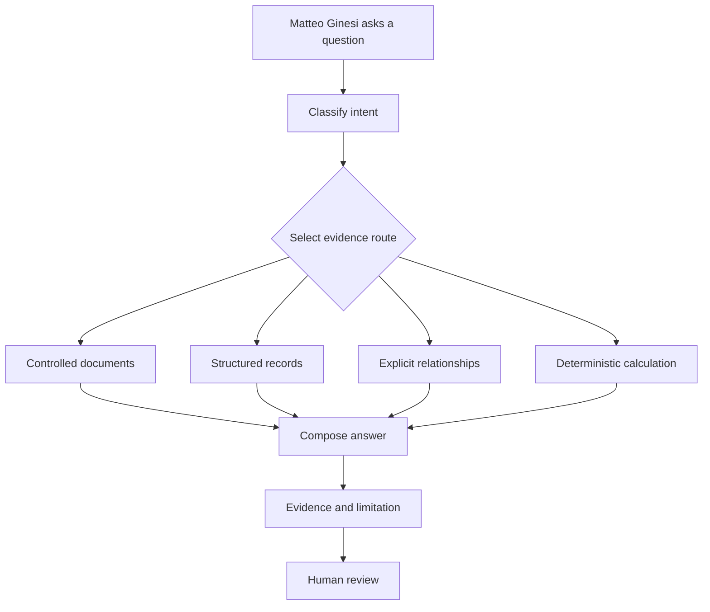

# Lab Assistant, diagrams, reports and export

## One assistant, three useful modes

Ask LabFlow is the single assistance system across the product. Researchers select a task, not an implementation technique:

- **Ask** finds and compares information across SOPs, processes, materials, solutions, stacks, experiments and results.
- **Inspect** checks completeness, units, provenance, consistency, comparability and export readiness.
- **Prepare** previews mappings, comparisons, report sections, evidence bundles and local submission packages.

The Knowledge page provides the complete conversation, scope, saved views and evidence panels. Compact actions inside Process, Experiment, Import, Results, Report and Export return to the same system with relevant context.

## Evidence routing



Deterministic code performs validation and arithmetic whenever possible. AI-style interpretation is reserved for ambiguous content and remains visibly labelled. Relationship graphs show what is connected; they do not turn association into causation.

## Scientific statement classes

- **Raw data** is an imported value preserved with its original file and field.
- **Derived result** is calculated from declared inputs and method.
- **Researcher statement** is an authored interpretation or conclusion.
- **AI suggestion** is reviewable guidance, never an approved finding.
- **Validation issue** is an error, warning, information item or labelled interpretation.
- **Evidence** identifies the exact record, field, sample, metric, document section or relationship supporting a statement.
- **Confidence** describes match quality and does not express scientific certainty.

Reports and exports must retain these categories. A polished sentence must never erase whether its basis was observed, calculated, stated or suggested.

## Graphs and diagrams

Diagram Studio is a local tool for small research workflows and evidence graphs. It supports top-to-bottom (`TD`) and left-to-right (`LR`) flowcharts, ordinary boxes, rounded nodes, decision nodes and directed edges.

```text
flowchart LR
  A[Raw measurement] --> B[Deterministic check]
  B --> C{Evidence complete}
  C --> D[Researcher review]
```

The renderer creates inline SVG, follows the active semantic theme and can download an editable SVG file. Documentation uses the same renderer for fenced `mermaid` blocks. Ask LabFlow uses it only when relationships materially clarify an answer. Graph definitions and rendered SVG remain local and contain no script or external reference.

## Proposed-action contract

A generated action includes a label, affected records, evidence summary, known limitations and explicit review controls. Confirmation changes only page memory. Assistant actions cannot modify raw files, authorize laboratory execution, exclude samples silently, approve conclusions or transmit a NOMAD package.

## Single report workflow

The **Report Composer** inside the Analysis & Report step is the only place where PDF, DOCX and XLSX reports are authored, reviewed and downloaded. The final Export step packages the reviewed outputs with structured project data and NOMAD previews; it does not expose a second report editor or a duplicate set of individual report actions.

## Report contract

The report preview and exporters share the same structured project representation. A report package includes:

1. identity, objective, author and laboratory context;
2. pipeline and experiment coverage;
3. solutions and device stack definitions;
4. raw-data and processing provenance;
5. results, figures and deterministic statistics;
6. findings separated by statement class;
7. validation issues, limitations and approvals;
8. export manifest and identifiers.

PDF is produced through **Print / Save PDF** from the current Report Composer preview. LabFlow clones the visible report DOM after applying the latest in-memory edits, then prints that same title, selected sections, text, data tables, charts, findings, conclusions, limitations, provenance and approval. There is no second hard-coded PDF layout and no separate PDF form model.

DOCX is an editable native package. Researcher-owned narrative sections use labelled content controls, while the report includes cover metadata, KPI, solution and stack reviews, experiment coverage, full measurement columns, findings and provenance. Its table of contents and document fields are marked for refresh when opened.

XLSX contains ten named sheets: Dashboard, Project, Solutions, Stack, Raw Data, Processed Data, Analysis, AI Findings, Provenance and Export Manifest. Pale amber cells identify editable inputs, pale green cells identify formulas, headers remain palette-aware and workbook calculation is forced on open. ZIP bundles keep machine-readable tables beside editable DOCX, XLSX and linked knowledge; PDF is printed separately from the Report Composer preview.

### Editing contract

- Edit the report inside the Report Composer; Print / Save PDF captures the exact current preview.
- PDF is a final reading artifact and is not a second editing surface.
- DOCX content controls identify researcher-authored sections without locking the rest of the document.
- XLSX formulas derive dashboard and processed values from the `Raw Data` sheet; edit the highlighted cells, then recalculate before review.
- Every format retains the distinction between raw, calculated, researcher-authored and simulated AI content.

## NOMAD demonstration boundary

LabFlow previews mappings and creates a transparent local package. It does not store credentials, negotiate remote schemas or submit records. Blocking validation issues remain visible in the preview and must be resolved before any later connected workflow could be considered.

## Review checklist

Before accepting a finding or export, verify the selected project and experiments, source versions, units, mapping and conversions, exclusions, comparison criteria, statement classes, unresolved issues, report author and manifest. For diagrams, also verify that every edge represents a documented relationship and that the caption states any causal limitation.

The current behavior is a deterministic demonstration, not a scientific validation service. Researchers must consult controlled procedures and exercise domain judgement before laboratory action.
