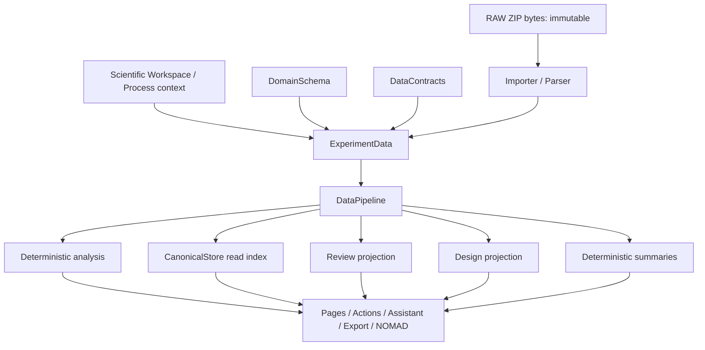
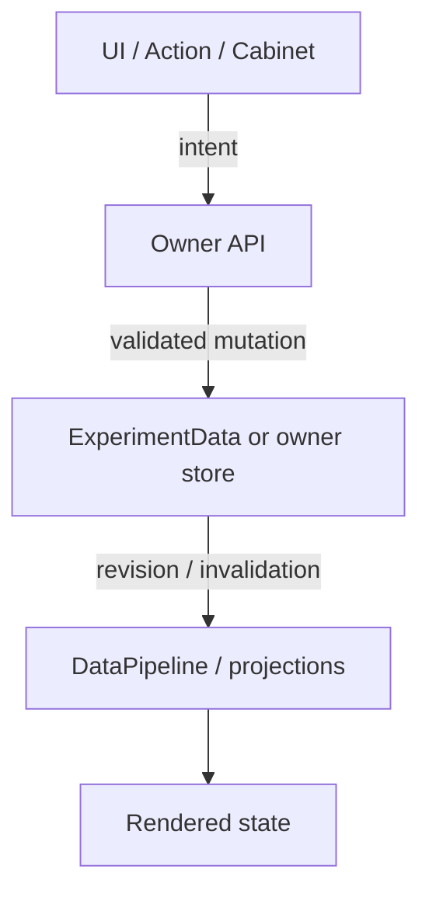
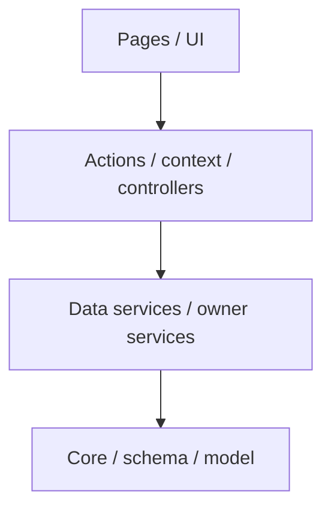
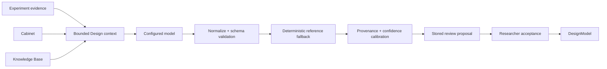

# Architecture

This document is the contributor-facing architectural source of truth. LabFlow remains deliberately small: a static browser application with explicit contracts, owner modules and deterministic build/validation tools. Extensibility must preserve that simplicity.

## 1. System boundary

LabFlow has no application server owning scientific state.



External AI providers are optional network dependencies called directly from the browser. They are not part of the deterministic scientific lifecycle.

## 2. Single aggregate rule

There is exactly one mutable scientific aggregate:

```text
LF.State.state.experiment : ExperimentData
```

A feature may own a projection, index, reference library, runtime state, or Action output, but it must not create another editable representation of experiments/samples/runs/measurements.

This rule prevents two classes of defects: disagreement between parallel models and mutations that bypass revision/provenance/invalidation.

## 3. Ownership model

### `DomainSchema`

Owns record factories/defaults, root ownership metadata, persistent-root metadata, normalization, and the snapshot shape. New scientific defaults are defined here once.

### `DataModel` / `ExperimentData`

Owns aggregate mechanics, hydration/restoration, stable query helpers, revision-aware commit operations and serialization entry points. It does not own feature policy.

### `DataContracts`

Owns fail-closed validation of aggregate/snapshot invariants. External or persisted data must pass the current snapshot contract before hydration.

### `DerivedState`

Owns dependency-based invalidation for recomputable projections. Feature-specific invalidation must be registered here rather than accumulated inside `State.touch()`.

### `DataPipeline`

Owns deterministic lifecycle planning/execution. Stages declare dependencies, reads and writes and must be idempotent for unchanged input.

### `CanonicalStore`

Owns pure read indexes and evidence lookup over the current aggregate. It is disposable/rebuildable and may not become another source of truth.

### `DesignModel`

Owns every Design write. Pages, Cabinet, Actions and Assistant code coordinate Design changes through this API rather than assigning `exp.design.*` directly.

### `DatasetCorrections`

Owns reviewed dataset-correction semantics, patch/provenance commit and any canonical rebuild required by an accepted correction.

### `ActionData`

Owns persisted Action proposals, annotations and Action status. Action output must not leak into ad-hoc scientific root fields.

### `Workspace`

Owns the browser-local scientific environment: institution, role contacts, locations, storage descriptors and reusable scientific Process definitions. It is contextual/reference state, not measurement evidence. Experiments bind to it by stable `workspaceId`/`processId`. Workspace contacts are excluded from scientific export snapshots by default.

### `Cabinet`

Owns reusable laboratory reference resources and their browser-local storage contract. Cabinet is outside scientific truth until a resource is explicitly copied into Design through `DesignModel`.

### `KnowledgeBase`

Owns validated bundled/custom reference knowledge. KB entries can inform reasoning but are never evidence that a current experiment has a property.

### `Structures`

Owns metadata describing structures that cross module boundaries: owner, layer, persistence class, required fields and field descriptions. It owns no runtime values, defaults, validation or mutation behavior.

### `State`

Owns the application shell state: one `ExperimentData`, transient `ui` state and one active Action run. It coordinates revision/invalidation but is not a scientific feature owner.

## 4. Persistence classes

Every cross-module structure should fall into one of these classes:

| Class | Meaning | Examples |
|---|---|---|
| scientific persistent | serialized with current experiment | measurements, Design, patches |
| Action persistent | reviewable Action output | proposals, annotations, statuses |
| reference persistent | separate reusable browser-local data | scientific Workspace/Processes, Cabinet, custom KB JSONL |
| preference persistent | browser-local configuration | provider/UI/NOMAD settings |
| runtime derived | recomputable/session-only | indexes, pipeline trace, active run |
| UI runtime | presentation/session-only | route, selection, open panels |

Persistence is explicit. Unknown runtime properties must not silently enter scientific snapshots.

## 5. Mutation flow

The safe pattern is:



Pages and controllers may collect user input and choose an owner operation; they do not become owners by virtue of being the caller.

## 6. RAW evidence and provenance

Archive bytes and RAW paths are immutable. LabFlow stores normalized/canonical interpretations separately. Corrections are patches over LabFlow Data and retain target, operation, before/after meaning and reason/provenance.

A transformation that would require rewriting RAW evidence is out of scope for the current architecture.

## 7. Workspace, Cabinet and KB boundary

The three browser-local reference domains are intentionally separate:

- **Workspace/Process:** describes where/how data is normally generated and managed;
- **Cabinet:** reusable laboratory resources and infrastructure definitions;
- **KB:** general/reference knowledge.

A Process may reference Cabinet instruments, acquisition software, setups and file-format definitions by stable ID. These references describe the expected acquisition environment; they do not prove that a specific measurement used a resource unless experiment evidence or measurement provenance says so.


Cabinet and KB solve different problems:

- **Cabinet:** reusable lab definitions the researcher may intentionally copy into Design.
- **KB:** general/reference knowledge used to support interpretation or reasoning.

Neither source is experiment evidence by itself. Context builders must preserve this distinction so a model cannot mistake “available in my lab” or “known in literature” for “used/measured in this experiment.”

## 8. AI and Action boundary

AI is reached only through declared Action/provider paths. `ActionCapabilities` is the single preflight service for bindings and guards. The Runner re-checks capability immediately before execution.

Actions produce one of three semantic classes:

- proposal requiring explicit acceptance;
- derived annotation over deterministic data;
- read-only answer.

Structured AI output is schema-validated and may additionally pass semantic validation before storage. Provider success (HTTP 200) is not equivalent to Action success.

## 9. Dependency direction

High-level allowed direction:



Reference services such as Cabinet/KB may depend on core/storage and owner APIs, but must not import page behavior. Pages may invoke services; services must not discover state by scraping DOM.

Classic scripts make load order visible in HTML rather than imports. Required module dependencies therefore fail fast with explicit checks. Silent fallback objects are prohibited for required architecture modules.

## 10. Generated artifacts

Prompt, KB, Action, docs and UI-kit bundles are deterministic generated artifacts. The source files are Markdown/JSONL/JSON/HTML. A generated bundle is never the place to make a semantic change.

## 11. Error philosophy

Fail closed when a contract boundary is violated; degrade gracefully when an optional external capability is unavailable.

Examples:

- invalid persisted scientific snapshot → contract error;
- missing required runtime module → startup error;
- malformed Action result → rejected Action result, not stored success;
- provider unavailable → Action/Assistant failure, deterministic app remains usable;
- incomplete Cabinet item → editable but excluded from AI context/application until valid.

## 12. Extension rule

A new feature is acceptable when a reviewer can answer all of these without reading arbitrary code:

- Who owns its data?
- Is the data scientific truth, reference data, preference, derived state or UI state?
- Which API is allowed to mutate it?
- What invalidates its projections?
- Does it belong in the deterministic pipeline, an Action, or a service?
- How is the boundary tested?
- How is the structure discoverable at runtime?

If those answers are unclear, the feature is not architecturally complete.

## 13. Design inference reference architecture

Design inference intentionally splits **generation** from **scientific authority**:



`Context` retrieves Cabinet and KB candidates separately per missing Design domain. The model is never the authority for whether a reference is valid: `DesignAnalysis` verifies exact `CABINET:<id>` / `KB:<id>` markers and calibrates source nature. `ActionSteps` owns the deterministic reference fallback that can convert already supplied structured references into a proposal when a model omits them.

This separation is important for model portability. Small models gain structured support instead of returning empty data; stronger models can synthesize richer candidates; neither can convert a reusable resource or literature reference into current-experiment evidence.

Confidence is presentation/decision-support metadata over a proposal, not scientific state. The accepted value and its provenance are owned by `DesignModel`; the model's raw self-confidence has no authority by itself.
