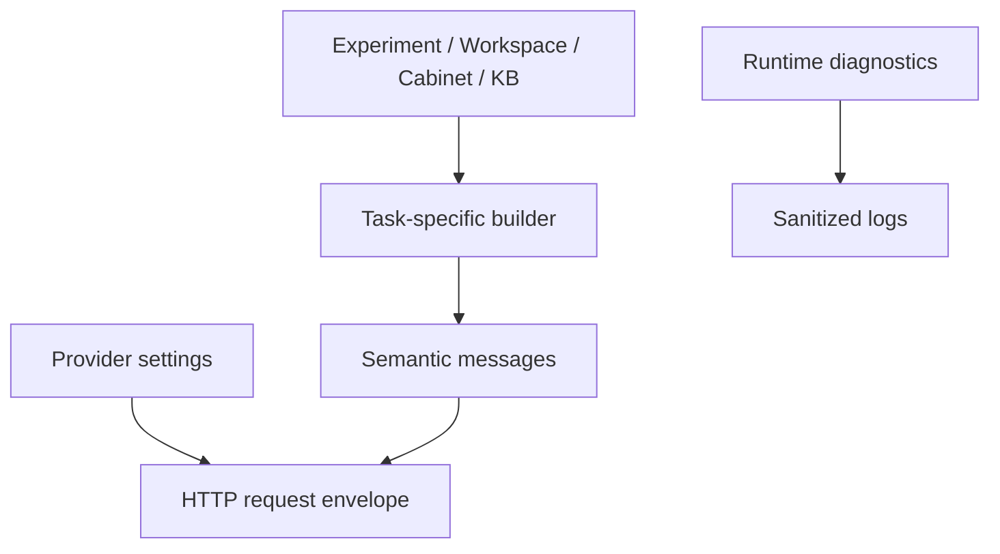

# AI context hygiene

LabFlow separates three kinds of request data:

1. **Semantic context** — scientific/reference facts intentionally placed in `messages`.
2. **Transport configuration** — provider, endpoint, model, credentials, streaming, sampling and reasoning controls.
3. **Runtime diagnostics** — request IDs, revision guards, budgets, timings, token usage, browser/network details and logs.

Only the first category is model input. Credentials and authorization headers are never logged or added to semantic context. Provider/model/network configuration and request diagnostics remain transport/runtime data.

## Assistant versus Actions

`assistant.chat` retains broad, bounded awareness: current page/selection, relevant records, deterministic Results, Action availability/output, short conversation memory and targeted Cabinet/KB references. Actions use dedicated profiles and do not inherit that broad base.

- `results.interpret` receives deterministic Results, anomalies and open findings.
- `results.compare` receives only selected groups, their statistics, selected measurement summaries and linked findings.
- `design.infer` receives the selected Design target, missing domains, relevant source evidence and deterministic Cabinet/KB candidates.
- `export.prepare` receives missing/allowed export fields and only the Workspace/Process/Cabinet/KB sections able to support those fields.
- ambiguity resolution receives selected findings, affected records and their evidence.

All profiles carry the same short authority rule: Experiment is current evidence; Workspace is researcher-defined context; Cabinet and KB are references; AI output is review-only until accepted.

## Structured output

Runtime validation still uses the complete JSON Schema and optional semantic validator. For Design, export preparation and Results output, the prompt uses a compact data-instance description. This avoids encouraging small local models to repeat JSON Schema keywords such as `properties`, `required`, `type` or `additionalProperties`.

## Representative before/after audit

These are approximate input-token estimates (`characters / 4`) from the same small two-measurement regression state. They measure semantic context plus its XML wrapper, not completion tokens. “Before” reconstructs the 0.0.28 shared-base composition; “after” is emitted by the 0.0.29 context diagnostic.

| Request | Before | After | Main removals | Retained |
|---|---:|---:|---|---|
| `results.interpret` | ~1,050 | ~460 | Workspace, page state, Experiment Brief, revision/budget metadata | deterministic summary/statistics, rankings, anomalies, findings |
| `results.compare` | ~950 | ~360 | Workspace, Experiment Brief, global findings/rankings | selected groups/statistics, selected measurement evidence, linked finding |
| `design.infer` | ~4,200 | ~3,700 | Workspace, page state, Experiment Brief, global Results | selected target/evidence, missing domains, Cabinet/KB candidates |
| `export.prepare` (contact-only) | ~2,500 | ~245 | Experiment Brief, performance/rankings, Action history, Cabinet, KB, Process | missing field/allowed ID and relevant Workspace contact |
| `assistant.chat` | ~2,850 | ~2,775 | runtime profile/revision/budget flags | broad bounded page/scientific/reference awareness |

Real sizes vary with the selected experiment and retrieved references. Correct evidence is retained before compaction; the target is the smallest sufficient context, not the smallest possible payload.

## Regression boundary

`tests/unit/context-test.js` rejects provider/transport/diagnostic keys in Action context and has negative tests for export, comparison and Design profiles. The Design tests also prove that per-domain reference candidates survive severe compaction and remain available to the independent deterministic fallback.
