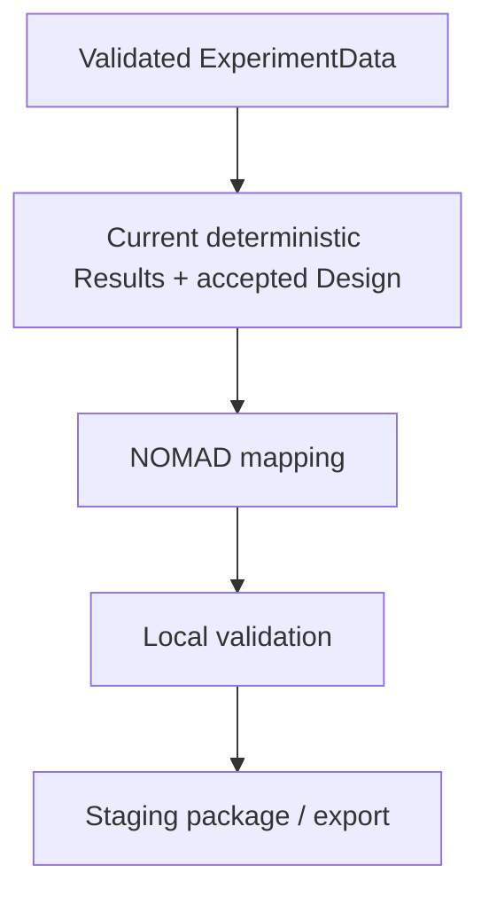

# NOMAD integration

NOMAD support is a deterministic interoperability projection, not an AI Action and not a second scientific model.

## Rules

- mapping/package generation never mutates RAW or scientific state;
- missing semantics remain explicit rather than model-filled;
- relevant scientific mutations invalidate stale NOMAD projections;
- exported analysis comes from the deterministic pipeline;
- Design values retain their provenance/acceptance state;
- NOMAD compatibility influences identifiers/units/provenance without dictating the researcher-facing mental model.

## Upload status

The UI exposes a future upload target, but the current control is explicitly a stub. It performs no upload request. Browser-local NOMAD endpoint/account/token settings exist only to make the future integration contract visible.

A real connector must replace the stub with an explicit network boundary, authentication behavior, upload status model and tests; it must not be implemented as a hidden side effect of package generation.
