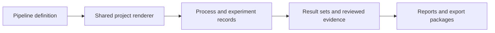
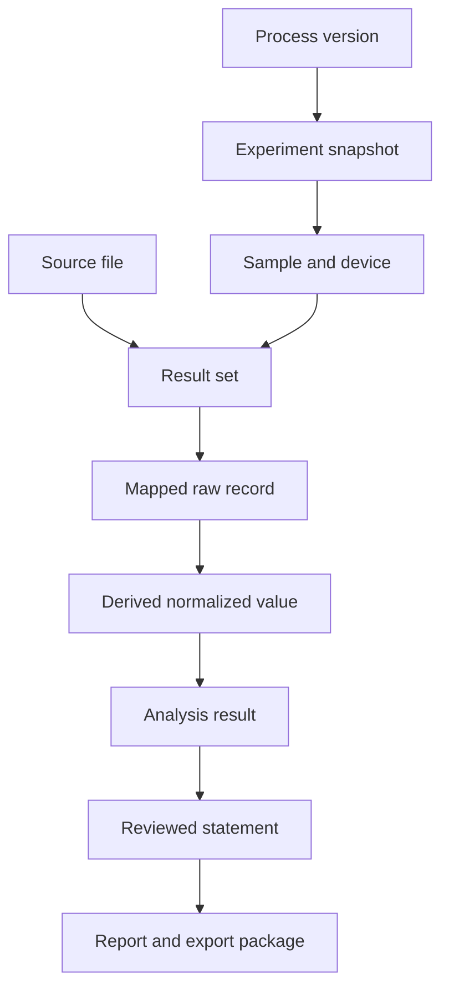

# Pipelines, records and provenance

## Why pipelines are declarative

A pipeline describes workflow: ordered steps, labels, expected outputs and the shared project view used by each step. It does not duplicate HTML, component styling or export layouts. Pipeline steps organise work around domain records; they never replace the identities of a Process, Experiment, Result Set or Report.



Pipeline identifiers and versions travel with the project and its export manifest. Steps remain revisitable. The current step indicates workflow focus rather than locking earlier records or evidence.

## CHOSE workflow contract

The primary perovskite workflow contains four user-facing steps:

```text
Process → Experiment → Results → Review & Export
```

The dedicated [CHOSE workflow guide](PIPELINE_CHOSE.md) documents the full screen, data and completion contract. The [pipeline catalog](PIPELINE_CATALOG.md) also describes the included Quick Measurement Review example.

The four steps are deliberately record-centred rather than screen-centred. Each step owns one scientific responsibility:

| Step | Creates or edits | Must not own | Primary completion question |
| --- | --- | --- | --- |
| Process | Versioned solution, substrate, operation and stack definitions | Prepared batches, operators, actual execution or result files | Is the reusable protocol explicit and versionable? |
| Experiment | Process snapshot, batches, samples/devices, actual parameters, timings and deviations | Rewriting the reusable Process or storing measurement files as notes | Is the real execution traceable? |
| Results | Source files, mapping, normalized records and deterministic quality state | Research conclusions or hidden automatic repairs | Are measurements linked, mapped and reviewable? |
| Review & Export | Comparisons, findings, human decisions, report and local packages | Model management, silent submission or evidence-free claims | Is the evidence ready for an approved output? |

### Process

Process defines a reusable, versioned laboratory protocol. It contains three contained sections rather than three additional pipeline steps:

- **Chemistry** — solution definitions, solvents, solutes, stock-solution references, scale formulas and handling instructions;
- **Fabrication** — substrate definition and an ordered sequence of planned preparation, deposition, annealing and contact operations;
- **Stack Review** — the expected device architecture derived from the fabrication sequence and reviewed by the researcher.

A Process stores planned values and expected evidence. It does not contain a prepared batch identifier, operator, actual execution time, sample instance or result file.

### Experiment

Experiment is a concrete execution of an immutable Process snapshot. It records:

- actual solution batches and material lots;
- substrate, sample and device instances;
- operator, date, equipment and environment;
- planned versus actual values;
- execution times, deviations and researcher decisions.

Editing a reusable Process never changes an existing Experiment. A new experiment references a specific Process version or snapshot.

### Results

Results creates named Result Sets linked to an Experiment. It separates:

- source files and their provenance;
- field and unit mapping;
- normalized derived records;
- deterministic quality review.

The product term is **Results** because file ingestion is an implementation operation rather than the researcher's objective.

### Review & Export

Review & Export contains four contained views:

- **Overview** — scientific KPIs, charts and the validated dataset;
- **Compare** — grouped experiment and process comparisons;
- **Findings** — deterministic issues, advisory findings and researcher review state;
- **Report & Export** — the canonical Report Composer, structured files, complete project package and local NOMAD preview.

Tools and AI model management remain in their dedicated product workspaces. The Project view may show evidence-linked findings but does not duplicate the global Ask LabFlow control.

## CHOSE interaction and layout contract

The Project page follows the shared workflow composition rather than exposing every domain object at once. The page-level navigator contains exactly four steps. Each step uses one contained tab bar for local sections and keeps its working data in the same wide page wrapper.

```text
Project context and status
→ four-step navigator
→ concise current-step heading
→ contained tabs
→ scientific work surface
→ explicit workflow actions
```

The Process step pairs editing with deterministic review. At wide desktop sizes Solution Builder and Solution Review remain side by side; they stack only when the available viewport would compress their fields. Fabrication tables, sample tables and execution tables keep their own horizontal scroll region.

A step can be revisited even after later work exists. Completion is a visible state, not a hard navigation lock. Blocking errors prevent the affected export or approval action; warnings remain attached to the record and may allow the researcher to proceed with an explicit caveat.

### Step gates

- **Process ready** — identifiers, units, required operations and stack representation are complete.
- **Experiment ready for Results** — process snapshot, batch/sample/device links and actual execution records exist; deviations are visible.
- **Results ready for Review** — files or manual records have stable provenance, mappings are confirmed and deterministic errors are resolved or explicitly blocking.
- **Review ready for package generation** — selected report sections, researcher text, findings and export limitations are visible. NOMAD remains a local readiness preview.

## Canonical data layers

- `settings.yaml` defines checked-in product defaults and feature boundaries.
- Pipeline YAML defines available workflows and step contracts.
- Demonstration records represent projects, process versions, experiments, samples, batches, result sets, measurements, evidence and saved views.
- Browser snapshots mirror canonical settings, pipelines and documentation for request-free direct-file operation.

After editing a canonical source, refresh its checked-in snapshot before validation. Generated snapshots are implementation artifacts, not competing documentation.

## Record identity and lineage

Stable identifiers connect the domain flow:

```text
User → Workspace → Project → Process Version → Experiment → Sample / Device → Result Set → Measurement
```

A derived value retains its input record, method and unit. A report statement retains source, sample, metric and value. Renaming a display label must not break these links.



## Critical entity distinctions

The implementation and UI must preserve these non-equivalences:

```text
Solution Definition ≠ Prepared Solution Batch
Process Definition ≠ Process Version / Snapshot
Stack Definition ≠ Device Instance
Planned Parameter ≠ Actual Parameter
Experiment ≠ Result Set
Raw Value ≠ Derived Value
AI Finding ≠ Researcher Conclusion
```

A definition may be reused from the Lab Cabinet. Reuse creates a traceable snapshot or reference; later edits do not mutate historical experiments.

## Smart Import contract

Smart Import profiles a selected local file and proposes field mappings. The mapping table shows source column, target field, source unit, target unit, conversion and status. Normalized preview values are displayed before confirmation. Missing identifiers, invalid units and ambiguous columns are never silently repaired.

Import presets exist only during the page session. The source file remains conceptually immutable; normalized values are derived records with explicit lineage.

## Solution, process and stack structure

A **Solution Definition** includes type, composition, concentration, solvent ratio, quantities, units, scale formula, preparation handling, before-use handling and review state. A **Solution Batch** adds preparation date, operator, actual quantities, environmental context, QC and use links.

A **Process Definition** includes substrate constraints and ordered operations with planned parameters, expected duration, material or solution references and required/optional state. A **Process Version** freezes these fields for experiment reuse.

A **Stack Definition** includes ordered layers, material, thickness, function and producing process operation. Builder, Review, scientific visual and report preview consume the same ordered representation rather than maintaining parallel copies.

## AI-ready dataset records

Pipeline outputs may later become dataset inputs, but a pipeline step is never itself a training dataset. LabFlow creates an explicit **Dataset Snapshot** containing source projects and experiments, included and excluded samples, feature and target schemas, units, transformations, quality filters, split policy, creator, timestamp and version.

The canonical progression is:

```text
raw file → mapped measurement → validated record → derived feature → dataset snapshot → model run → prediction → human review
```

Raw, validated, processed, derived, predicted and researcher-approved values remain distinct. Labels and targets record whether they were observed, calculated, researcher-assigned, suggested or confirmed. No model output may overwrite a measurement or silently become a scientific conclusion.

## Data-quality severity

- **Error** blocks the affected export or scientific action.
- **Warning** requires review and may limit comparison.
- **Information** records a relevant deterministic fact.
- **Suggestion** proposes a next step without changing data.

Ambiguous free text may be interpreted only as a labelled suggestion. Missing scientific values are not invented.

## Change discipline

When a pipeline contract changes, update the pipeline source, data defaults, corresponding browser snapshot, UI Kit, canonical product documentation and validation expectations together. Remove obsolete guidance instead of leaving two workflow versions. When data or exporter contracts change, regenerate example artifacts and inspect their structure and visual presentation.
