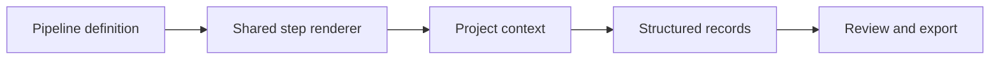
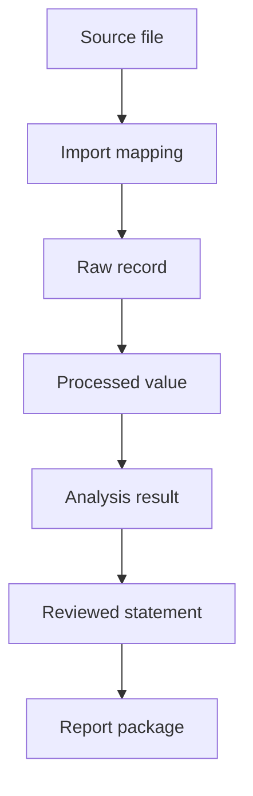

# Pipelines, records and provenance

## Why pipelines are declarative

A pipeline describes workflow: ordered steps, labels, completion rules, allowed actions and the project views each step uses. It does not duplicate HTML, component styling or export layouts. This separation lets the CHOSE process and Quick Measurement Review reuse the same shell and scientific controls.

Pipeline identifiers and versions travel with the project and its export manifest. Steps are revisitable; the current step indicates workflow focus rather than locking earlier evidence away.

## Canonical data layers

- `settings.yaml` defines checked-in product defaults and feature boundaries.
- Pipeline YAML defines available workflows and step contracts.
- Demonstration records represent projects, Cabinet objects, experiments, measurements, evidence and saved views.
- Browser snapshots mirror canonical settings, pipelines and documentation for request-free direct-file operation.

After editing a canonical source, refresh its checked-in snapshot before validation. Generated snapshots are implementation artifacts, not competing documentation.

## Record identity and lineage

Projects, experiments, samples, solution batches, stacks, mappings, source files and findings use stable identifiers. A derived value retains its input records, method and unit. A report statement retains source, sample, metric and value. Renaming a display label must not break these links.

## Smart Import contract

Smart Import profiles a selected local file and proposes field mappings. The mapping table shows source column, target field, source unit, target unit, conversion and status. Normalized preview values are displayed before confirmation. Missing identifiers, invalid units and ambiguous columns are never silently repaired.

Import presets exist only during the page session. The source file remains conceptually immutable; normalized values are derived records with explicit lineage.

## Solution and stack structure

A solution record includes composition, concentration, solvent ratio, quantities, units, preparation notes, batch identity and review state. A stack record includes ordered layers, material, thickness, function, process and version. Builder, Review, scientific visual and report preview must consume the same data rather than maintaining parallel copies.

## Data-quality severity

- **Error** blocks the affected export or scientific action.
- **Warning** requires review and may limit comparison.
- **Information** records a relevant deterministic fact.
- **Suggestion** proposes a next step without changing data.

Ambiguous free text may be interpreted only as a labelled suggestion. Missing scientific values are not invented.

## Diagram data

Graph definitions are plain text stored only in page memory when edited in Tools. The local renderer accepts a restricted syntax and returns SVG. Diagrams used in documentation or answers communicate workflows and explicit links; they are not an independent source of scientific truth. Labels should use stable identifiers where traceability matters.

## Change discipline

When a pipeline contract changes, update the pipeline source, corresponding snapshot, relevant product documentation and validation expectations together. Remove obsolete guidance instead of leaving two versions. When data or exporter contracts change, regenerate example artifacts and inspect their structure and visual presentation.
