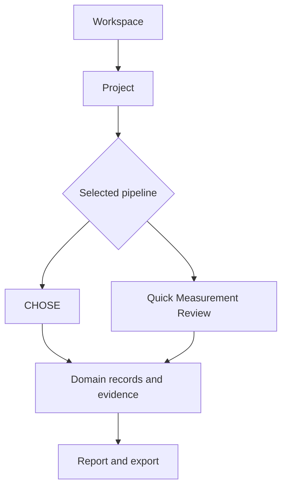

# Pipeline catalog

LabFlow pipelines describe **how work is organised and verified**, not how pages are styled. A simple example may provide navigation metadata only; a primary domain pipeline can additionally define record boundaries, sections, completion rules, expected evidence, mappings and export policy. Shared HTML, CSS and report engines remain application components rather than being copied into YAML.

## Available pipelines

| Pipeline | Status | Purpose | Steps |
| --- | --- | --- | --- |
| CHOSE Perovskite Workflow | Primary | Full perovskite process, experiment, results and review workflow | Process → Experiment → Results → Review & Export |
| Quick Measurement Review | Example | Compact proof that focused workflows can reuse the same LabFlow shell | Plan → Add Data → Report → Export |

## Pipeline selection

A Project selects one pipeline by stable `pipeline.id`. The selection determines its step navigator and the renderer used for each step; it does not change the identity of the Project or the records it owns.

A navigation-only example contains stable identity, ordered steps, labels, views and outputs. An executable domain contract such as CHOSE additionally contains:

- `schema_version`, domain and compatibility constraints;
- explicit record entities and Process/Experiment/Results/Review boundaries;
- build-time `resource_refs` for schemas, defaults, mappings and demo records;
- contained sections linked to a strict registered component ID;
- records read and created by every step;
- completion requirements, deterministic rules and expected evidence;
- finding-review and export/NOMAD policy.

## Common rules

Every pipeline must preserve the following product contracts:

1. Steps remain revisitable; the current step shows focus rather than creating an irreversible lock.
2. A step creates or reviews explicit records and states its expected output.
3. Errors, warnings and incomplete evidence remain attached to the affected record.
4. Raw data, normalized values, calculated results, suggestions and approved conclusions remain distinct.
5. Pipeline YAML never embeds page-specific CSS, large HTML fragments or export templates.
6. A pipeline change requires synchronized source YAML, browser bundle, documentation, UI Kit references and validation checks.

## Canonical sources

The canonical entry definitions are stored under `pipelines/<pipeline-id>/pipeline.yaml`. Referenced resources remain inside the same pipeline directory. `tools/build_pipeline_bundle.py` resolves and embeds them in the checked-in request-free `assets/js/pipeline-bundle.js`; `tools/validate_poc.py` verifies that the snapshot is exact.

Use the dedicated guides for the domain and UI contract of each included workflow:

- [CHOSE Perovskite Workflow](PIPELINE_CHOSE.md)
- [Quick Measurement Review](PIPELINE_QUICK.md)
- [Pipelines, records and provenance](PIPELINES_AND_DATA.md)
