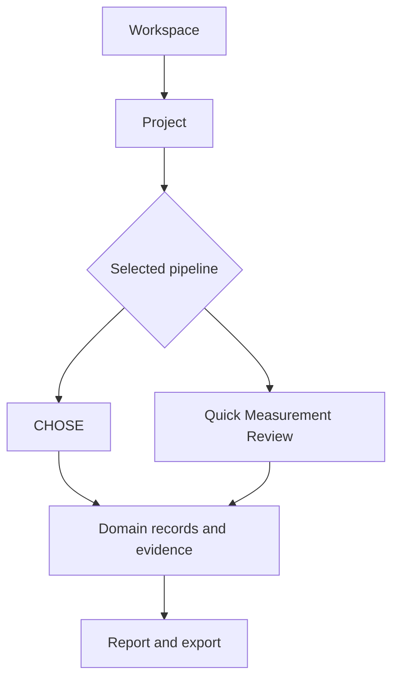

# Pipeline catalog

LabFlow pipelines describe **how work is organised**, not how pages are styled. A pipeline supplies stable identifiers, ordered steps, completion outputs and the renderer contract used by a Project. Shared HTML, CSS, scientific components, reports and export rules remain part of the application rather than being copied into each YAML file.

## Available pipelines

| Pipeline | Status | Purpose | Steps |
| --- | --- | --- | --- |
| CHOSE Perovskite Workflow | Primary | Full perovskite process, experiment, results and review workflow | Process → Experiment → Results → Review & Export |
| Quick Measurement Review | Example | Compact proof that focused workflows can reuse the same LabFlow shell | Plan → Add Data → Report → Export |

## Pipeline selection

A Project selects one pipeline by stable `pipeline.id`. The selection determines its step navigator and the renderer used for each step; it does not change the identity of the Project or the records it owns.

A pipeline definition contains:

- stable `id`, display `name` and `version`;
- status and intended project type;
- concise description;
- ordered step identifiers;
- user-facing titles and descriptions;
- renderer view name;
- expected output for each step.

## Common rules

Every pipeline must preserve the following product contracts:

1. Steps remain revisitable; the current step shows focus rather than creating an irreversible lock.
2. A step creates or reviews explicit records and states its expected output.
3. Errors, warnings and incomplete evidence remain attached to the affected record.
4. Raw data, normalized values, calculated results, suggestions and approved conclusions remain distinct.
5. Pipeline YAML never embeds page-specific CSS, large HTML fragments or export templates.
6. A pipeline change requires synchronized source YAML, browser bundle, documentation, UI Kit references and validation checks.

## Canonical sources

The canonical definitions are stored under `pipelines/<pipeline-id>/pipeline.yaml`. `tools/build_pipeline_bundle.py` produces the checked-in request-free browser snapshot in `assets/js/pipeline-bundle.js`.

Use the dedicated guides for the domain and UI contract of each included workflow:

- [CHOSE Perovskite Workflow](PIPELINE_CHOSE.md)
- [Quick Measurement Review](PIPELINE_QUICK.md)
- [Pipelines, records and provenance](PIPELINES_AND_DATA.md)
