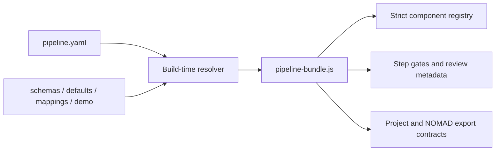

# CHOSE Perovskite Workflow

The CHOSE pipeline is LabFlow’s primary domain workflow for perovskite research. It turns reusable laboratory definitions into traceable experiment executions, validated result sets and evidence-linked reports without mixing planned and actual data.

## Workflow at a glance

```text
Process → Experiment → Results → Review & Export
```

| Step | Scientific responsibility | Main output |
| --- | --- | --- |
| Process | Define reusable chemistry, substrates, fabrication operations and the expected stack | Versioned process definition |
| Experiment | Instantiate a process snapshot and record what was actually prepared and executed | Traceable experiment execution |
| Results | Attach measurements, map fields and units, normalize records and review deterministic quality | Validated result sets |
| Review & Export | Analyse, compare, review findings, approve conclusions and generate transparent packages | Reviewed report and export package |

## Step 1 — Process

Process is a reusable and versioned protocol. It contains three contained views rather than three additional pipeline steps.

### Chemistry

Chemistry defines solution recipes and reusable material references:

- solution name and scientific role;
- custom, commercial or Cabinet-derived definition;
- solvents, solutes and stock-solution references;
- concentration, target volume and scale formula;
- preparation and before-use handling;
- explicit units, notes and deterministic validation.

A recipe does **not** contain a prepared-batch identifier, preparation date, operator or actual quantities. Those belong to Experiment.

### Fabrication

Fabrication defines the expected substrate and ordered operations:

- substrate material, rigidity, dimensions, thickness and roughness;
- optional alternative substrates;
- cleaning and preparation operations;
- deposition, annealing, treatment and contact operations;
- referenced solution or material;
- planned parameters, units, duration and required state;
- expected equipment category and evidence.

The operation sequence is the process source of truth. It must be possible to read it as an ordered laboratory protocol without opening an unrelated screen.

### Stack Review

Stack Review derives the expected layer order from fabrication operations and lets the researcher inspect:

- layer material;
- scientific function;
- thickness and unit;
- producing operation;
- validation or unresolved mismatch.

Manual corrections are allowed, but the application must not maintain two unrelated stack representations. Builder, review, report and export consume the same ordered model.

### Completion gate

Process is ready when stable identifiers, required chemistry, units, substrate constraints, ordered operations and stack representation are complete. Readiness creates a versioned definition; it does not create an Experiment.

## Step 2 — Experiment

Experiment records one concrete execution of an immutable Process snapshot.

### Setup and lineage

The experiment header exposes:

- Experiment ID and name;
- selected Process and version;
- snapshot timestamp;
- date, operator and status;
- project and workspace lineage.

Changing the reusable Process later must not rewrite an existing Experiment.

### Materials and batches

The researcher selects or records:

- prepared solution batches;
- actual quantities and preparation details;
- material and substrate lots;
- substitutions and deviations;
- links back to the reusable definitions used.

### Samples and devices

The sample matrix belongs here because samples are concrete instances. It records sample IDs, substrate instance, process variant, device identifiers, selected batches and status.

### Execution record

Each planned operation is paired with its actual execution:

| Operation | Planned | Actual | Time | State |
| --- | --- | --- | --- | --- |
| Spin coating | 4000 rpm · 30 s | 3950 rpm · 30 s | 10:21 | Completed |
| Annealing | 100 °C · 30 min | 100 °C · 28 min | 10:24 | Deviation |

Actual values, operator, equipment, start/end time, environment, deviation and notes remain visible. Deviations are scientific records, not errors to hide.

### Completion gate

Experiment is ready for Results when its Process snapshot, batch/sample/device links and actual execution records exist, with unresolved deviations explicitly visible.

## Step 3 — Results

Results is organised into three contained views.

### Files

Source files keep original identity and provenance. Each file shows associated Experiment, sample/device, measurement type, parse status and any unresolved link.

### Mapping

Smart Import displays source column, destination field, source unit, target unit, conversion, confidence and preview. Suggested mappings never silently overwrite source data.

### Quality Review

Deterministic review covers missing identifiers, invalid units, duplicate or orphan records, mismatched device counts, incomplete sample links and normalized-data preview. The initial state must also work when no files have yet been added.

### Completion gate

Results is ready for Review when source provenance is stable, mappings are confirmed and deterministic errors are resolved or explicitly blocking.

## Step 4 — Review & Export

The final step contains four views.

### Overview

Overview presents selected scientific KPIs, charts, the validated dataset, filters and visible quality limitations.

### Compare

Compare groups experiments by formulation, Process version, batch, operator, equipment or actual process parameter. Comparison never removes the quality context of the included records.

### Findings

Findings distinguishes:

- deterministic observation;
- calculated result;
- correlation;
- hypothesis;
- AI suggestion;
- researcher conclusion.

Every non-trivial statement keeps evidence links and review state. AI suggestions do not become conclusions without explicit researcher approval.

### Report & Export

The Report Composer and export area provide a common approved state for PDF, DOCX, XLSX, LaTeX, complete project package and local NOMAD readiness preview. Export generation is transparent and does not imply remote submission.

## UI composition

CHOSE always uses the wide Project wrapper and follows this order:

```text
Breadcrumb
→ Project header
→ Project summary
→ four-step navigator
→ current-step heading
→ contained tabs
→ scientific work surface
→ workflow action footer
```

At wide desktop sizes paired Builder/Review surfaces remain side by side. They stack before scientific fields become compressed. Tables and diagrams use local overflow rather than widening the page.

The global Ask LabFlow control remains in the topbar. Step content may show evidence-linked findings or suggested actions, but it must not repeat a separate assistant launcher in every panel.

## Executable pipeline contract

The CHOSE workflow is no longer defined only by navigation labels. Its canonical entry point is `pipelines/chose/pipeline.yaml`, which declares the scientific contract used by the static renderer, validators and export package.

```text
pipelines/chose/
├── pipeline.yaml
├── schemas/
│   ├── process.yaml
│   ├── experiment.yaml
│   ├── results.yaml
│   └── review.yaml
├── defaults/
│   ├── solution-types.yaml
│   ├── operation-types.yaml
│   └── units.yaml
├── mappings/
│   ├── jv-import.yaml
│   └── nomad.yaml
└── demo/
    ├── process.yaml
    ├── experiment.yaml
    ├── results.yaml
    └── review.yaml
```

### What `pipeline.yaml` owns

The entry contract defines:

- pipeline identity, schema version, compatibility and domain;
- entities used by the workflow;
- boundaries between planned Process data and actual Experiment data;
- ordered steps and their local sections;
- registered UI component identifiers;
- records read and created by each step;
- completion labels, required paths, validation rules and expected evidence;
- finding-review policy;
- enabled export formats and the NOMAD readiness profile;
- references to the smaller schema, defaults, mapping and demonstration files.

It deliberately does not contain HTML fragments, CSS declarations or report templates. A section selects a registered component such as `chose.process.chemistry`; the shared application implements that component once.

### Referenced resources

The files under `schemas/` define record shape and invariants. `defaults/` provides controlled domain choices and accepted units. `mappings/` makes import and NOMAD decisions inspectable. `demo/` contains the illustrative records rendered by this POC; it is not mixed into application logic.

`tools/build_pipeline_bundle.py` resolves `resource_refs`, rejects paths outside the pipeline directory and embeds the resolved resources in `assets/js/pipeline-bundle.js`. The browser therefore receives one request-free contract when LabFlow is opened through `file://` or static hosting.




### Runtime evaluation

`assets/js/pipeline-runtime.js` resolves a step’s `demo_ref` and `schema_ref`, checks required document sections and field contracts, evaluates implemented completion validators and recursively evaluates `depends_on`. Under `contract.strict: true`, an unknown validator, missing schema, unresolved required path or cyclic dependency is an error rather than a permissive fallback.

The checked-in CHOSE scenario intentionally demonstrates different gate states:

| Step | Runtime state | Reason |
| --- | --- | --- |
| Process | Ready | schema, units, operation ordering, layer producers and capabilities pass |
| Experiment | Warning | the record is usable but one environmental field remains explicit as missing |
| Results | Blocked | a deterministic unresolved quality error remains |
| Review | Blocked | human review is pending and Results is an upstream blocker |

These states are calculated from the resolved YAML resources. They are not hardcoded labels in the page renderer.

### Shared report and export model

`LabFlowExport.buildReportDocument` reads Process, Experiment, Results and Review resources from the active resolved pipeline. The live preview, native PDF, editable DOCX, analysis workbook and LaTeX package consume this same model. Complete project and NOMAD-preview ZIPs also include the resolved contract and resource manifest. A change to a CHOSE scientific fixture therefore propagates to views and artifacts after rebuilding the pipeline bundle; it must not require copying values into exporter code.

### Source-of-truth rule

Domain values shown by the CHOSE Process, Experiment, Results and Review views must come from the resolved contract or from the current in-memory record being edited. `app.js` provides rendering and interaction; `workbook.js` provides format engines. Neither may become a second hidden store of solution definitions, fabrication operations, stack layers, measurement mappings, findings, report defaults or completion requirements.

The complete project ZIP includes:

- `pipeline/contract.json`, containing the resolved pipeline contract;
- `pipeline/resource-manifest.json`, identifying canonical resource references and embedded groups;
- a project YAML that records pipeline schema, version, sections, completion requirements and evidence expectations;
- the NOMAD mapping profile when a readiness preview is requested.

### Editing and validation

After changing any CHOSE YAML resource:

1. run `python tools/build_pipeline_bundle.py`;
2. run `python tools/build_frontend_bundles.py`;
3. rebuild documentation when its contract changed;
4. run `python tools/validate_poc.py`;
5. run `node tools/test_exports.mjs`.

Validation checks resource existence and path safety, schema markers, section-component registration, completion gates, Process-to-Experiment references, operation-to-layer producer links, import policy, source identities, report/provenance resources, NOMAD policy and exact bundle synchronization. The export test additionally executes the runtime gates and asserts that report, stack, solution, quality and source-file content is read from the active CHOSE resources.
