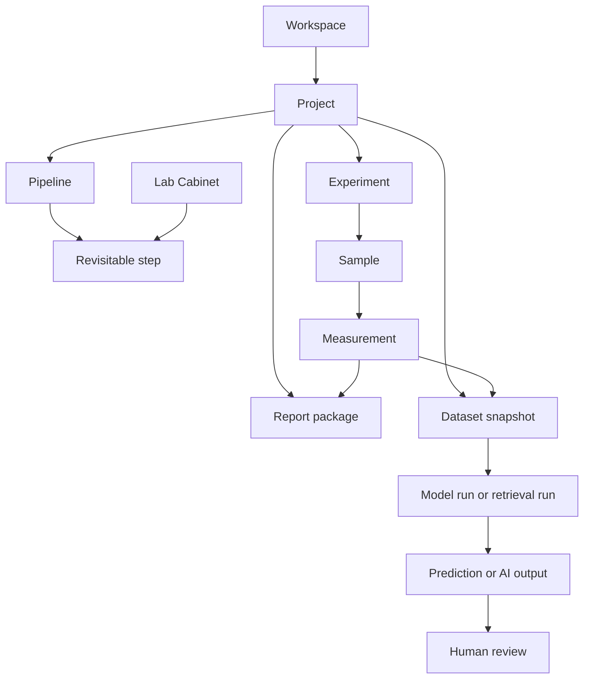
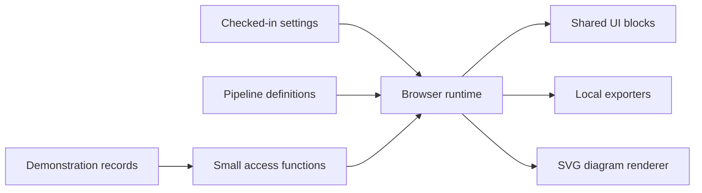
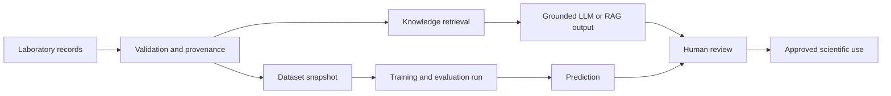
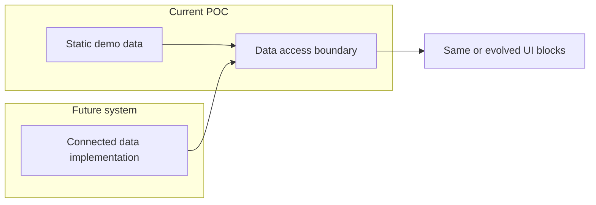

# Project model and architecture

## Purpose

LabFlow turns the structure of laboratory work into an inspectable product model. It demonstrates how a researcher can move from a project objective to prepared materials, experiments, evidence, analysis and export without losing identifiers, provenance or human control.

The POC is authored and directed by **Matteo Ginesi**. It is deliberately local and static: the goal is to validate information architecture, scientific interaction patterns and export contracts before connected infrastructure is introduced.

## Domain model

- **Workspace** is the all-project context.
- **Project** owns an objective, pipeline, people, progress and linked research records.
- **Pipeline** defines the ordered workflow and the completion contract for each step.
- **Experiment** connects fabrication context, samples, files and results.
- **Lab Cabinet** provides reusable materials, solutions, stacks, import mappings and analysis recipes.
- **Evidence** connects a claim to a source, record, field, metric or relationship.
- **Report package** preserves reviewed content, source references and export metadata.
- **Dataset snapshot** freezes selected rows, features, target, exclusions and provenance for reproducible analysis or training.
- **Model/AI output** records the model, prompt or run, its data and evidence, limitations and human review state.

Stable identifiers are visible wherever a record may be compared, cited or exported. A page title alone is never treated as provenance.

## Runtime architecture

Thin HTML entry pages load one shared UI system and a small set of local JavaScript modules. Semantic theme tokens, components and responsive layout are separated under `ui/`. Canonical settings and pipeline definitions are authored in YAML; checked-in JavaScript snapshots make them available during direct-file use. Demonstration records live in a transparent static dataset.

The shared application module renders navigation and common pages. Focused modules own Ask LabFlow, Tools, exports and diagrams. The diagram renderer accepts a deliberately small flowchart syntax and produces accessible inline SVG without a remote renderer or packaged library. This is a pragmatic split by responsibility, not an internal application framework.

## Data access boundary

`assets/js/data.js` is the single demonstration dataset. `LabFlowDataSource` exposes a small set of list and identifier lookups for projects, Cabinet resources, Knowledge items, tools, experiments, measurements and validation issues. The functions return the current checked-in records; they do not fetch, cache, persist or simulate a remote service.

New interaction code should call this boundary when it needs to locate domain records. It may still pass already-resolved objects directly to small render functions. Do not add repository classes, dependency injection, promise-based fake APIs or one file per entity.

Stable identifiers connect the flow **User → Workspace → Project → Process → Experiment → Sample → Measurement**. Pipeline steps organise the work around those records but do not replace them.

## AI-ready architecture

AI readiness belongs to the core domain model. Stable identifiers, explicit units, data classes, provenance and immutable dataset snapshots connect ordinary project work to future knowledge and predictive systems. The current POC demonstrates these records inside the existing data source and the single **AI & Models** workspace.

The browser remains independent of any specific LLM provider, vector database or ML framework. Future connected services should implement small product contracts such as `ask`, `retrieve`, `build_dataset`, `train`, `evaluate`, `predict` and `review`. See `AI_ML_FOUNDATION.md` for the full record and evaluation contract.

## Reusable UI blocks

Pages are compositions of a limited vocabulary: page and section headers, cards, panels, KPI blocks, toolbars, notices, forms, table containers, steppers, validation issues, assistant/evidence blocks, scientific Builder/Review pairs, report previews, modals and drawers. Their source styles live in `ui/`; page renderers combine them and add only layout adjustments that are genuinely specific.

The UI Kit is the visual ground truth and includes a registry of allowed variants and current product uses. A new block is justified only when no existing block can express a distinct interaction contract. Replacing a block requires removing its old markup and CSS, updating the UI Kit and updating the relevant canonical guide in the same change.

## State and privacy boundary

All mutable UI state is held in page memory. Selected tabs, settings edits, tool drafts, assistant conversation and proposed actions return to defaults after reload. Appearance parameters are carried between internal pages only long enough to prevent visual discontinuity.

The current demonstration includes no authentication, durable database, cloud synchronization, connected model provider, live NOMAD submission or multi-user collaboration. It makes no automatic external request and includes no cookies, storage APIs, trackers, telemetry, manifest or service worker. XML and SVG namespace declarations describe file formats; they are not network calls.

## Shared interaction contracts

Solution Builder and Review share one structured representation. Stack Builder, the 2D stack visual and report preview use the same ordered layers. Smart Import never hides mappings or conversions. Data-quality checks stay distinct from interpretation. Ask LabFlow routes questions internally to documents, structured records, deterministic calculations or explicit relationships while presenting one coherent assistant.

Every generated action shows its scope and consequence before an in-memory confirmation. Reload remains the universal reset mechanism.

## Demonstration scenario

The main scenario links project `PRJ-2026-014` to experiments `EXP-041`, `EXP-052` and `EXP-067`, samples `S01`–`S08`, solution batches, stack `STK-003/v2`, JV measurements, controlled knowledge, findings and NOMAD readiness checks. Matteo Ginesi is the illustrative researcher and report author.

The package also includes Quick Measurement Review to prove that pipeline files describe workflow instead of duplicating markup or visual systems.

## Deployment profile

All runtime dependencies are checked in. Paths remain relative, `.nojekyll` supports static publishing, and the same pages work from a local folder or a static hosting path. Connected deployment concerns are intentionally outside this POC; no UI copy should imply that remote submission, durable permissions or collaboration already exist.

## Future connection boundary

The present POC stops at the data-source functions. A future system may supply users, workspaces, processes, experiments, files, reports and assistant results from connected infrastructure, but no technology, endpoint or database design is selected here.

This seam keeps future replacement possible without making the current showcase pretend that connected capabilities already exist.

## Local diagnostics boundary

The static runtime exposes one structured logger through `window.LabFlowLogger` and `window.LabFlowLog`. It captures page lifecycle, renderer failures, state transitions and local export operations without creating telemetry. Entries remain in the console and in a bounded page-memory buffer, redact sensitive keys and are cleared with the page. Full contracts and examples are documented in [JavaScript logging and diagnostics](JAVASCRIPT_LOGGING.md).
