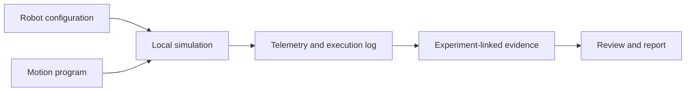
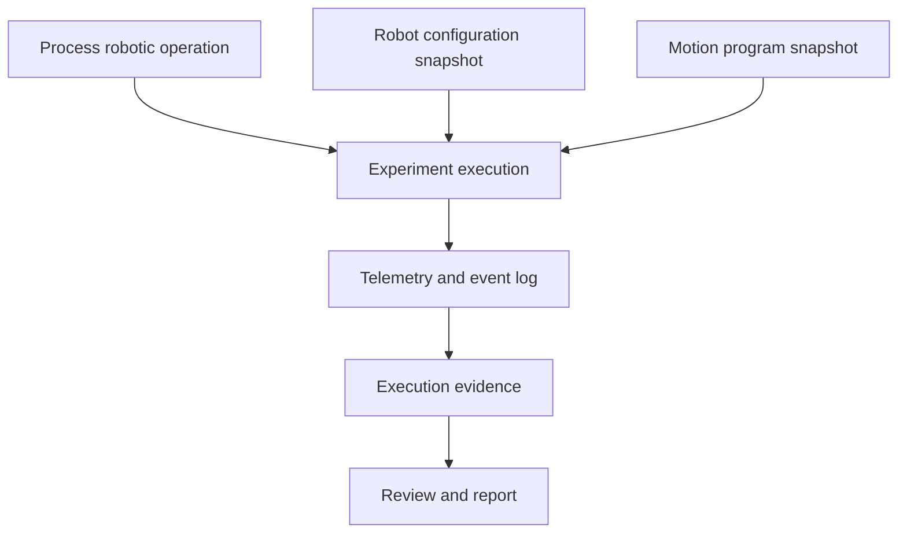

# Robotics capability

Robotics is a top-level LabFlow capability, parallel to AI & Models. It demonstrates how a laboratory can simulate, configure, execute and document robotic operations while preserving the same Project, Process, Experiment and evidence model used elsewhere in the platform.

Robotics is optional. Ordinary experiments must remain usable without a robot, controller, ROS installation or connected hardware.

## Product role

The Robotics page is a focused laboratory workbench rather than a generic industrial control panel. Its goals are to:

- visualise a robot and its current state clearly;
- move joints through safe, understandable controls;
- inspect frames, vectors, trajectory and configuration space;
- prepare and validate reusable motion programs;
- execute programs in a deterministic local simulation;
- preserve the resulting execution record as experiment-linked evidence.



## Scope of the proof of concept

The checked-in page controls a configurable three-joint arm through a deterministic local simulation. It performs no network request, has no browser persistence and does not imply a physical connection.

Implemented capabilities include:

- perspective canvas renderer with orbit, zoom and ISO/front/side/top camera presets;
- shaded links, articulated joint hubs, gripper geometry, floor shadows and depth-aware scaling;
- workspace guides, coordinate frames, TCP trail, pose markers, selected-program path and target ghosting;
- direct kinematics for J1 base rotation, J2 shoulder and J3 elbow;
- joint sliders, jog actions, Home, Reset and Stop;
- end-effector position, direction vectors, frames, target and recent trajectory;
- selectable two-dimensional configuration-space planes with simulated joint-history trace;
- session-only saved poses;
- YAML-like motion programs with import, download, validation and execution;
- pause, resume and stop behaviour with an execution timeline;
- compact state, telemetry and event logs;
- demonstration attachment of a completed run to an existing LabFlow project and sample.

## Page anatomy

The page follows the same wide 1600 px shell as Project, Workspace and other operational workbenches. It should read in this order:

```text
Breadcrumb and page header
→ robot identity and controller boundary
→ 3D simulation canvas
→ joint and jog controls
→ pose / program workbench
→ state, vectors and configuration space
→ execution timeline and evidence link
```

The canvas is the primary visual surface. Controls remain compact and grouped by task; the page must not become a wall of unrelated toggles. Camera controls, motion controls and evidence controls are visually separate.

At narrower widths, the inspector and control rails stack around the canvas. The canvas keeps a meaningful minimum height, while tables and program source use local scrolling. Page-level horizontal overflow is not allowed.

## Canonical configuration

`robotics/robot-arm-01.yaml` is the canonical checked-in configuration. `tools/build_robotics_bundle.py` produces the request-free browser snapshot in `assets/js/robotics-bundle.js`.

The configuration contains:

- schema and stable robot identity;
- simulation or controller mode;
- physical link dimensions;
- joint type, limits and home values;
- named poses;
- named motion programs;
- initial Project, sample and Process-step integration context.

The current schema is intentionally specific and small. It is not a general industrial robot schema and does not claim URDF compatibility.

## Joint and pose model

The demonstration arm contains exactly three revolute joints:

| Joint | Meaning | Demonstration range |
| --- | --- | --- |
| J1 | Base rotation | −160° to 160° |
| J2 | Shoulder | −25° to 120° |
| J3 | Elbow | −125° to 125° |

Named poses are stable joint-value snapshots such as HOME, PICK, INSPECT and DROP. Saving a pose in the POC affects only the current page session. A future backend should version pose definitions and preserve the exact snapshot used by an execution.

## Motion program contract

A motion program is an ordered list of explicit operations. Supported demonstration operations include:

- move to a named pose;
- move to explicit joint values;
- open or close the gripper;
- wait for a stated duration.

Each movement may define duration and the program may define a speed factor. Validation checks pose names, joint identifiers, limits, positive durations and supported operations before execution.

A compact example is:

```yaml
id: sample-inspection
name: Sample inspection
speed: 0.65
sequence:
  - {pose: HOME, wait_ms: 250}
  - {pose: PICK, duration_ms: 1000}
  - {gripper: close, wait_ms: 350}
  - {pose: INSPECT, duration_ms: 1150}
  - {wait_ms: 1200}
  - {pose: DROP, duration_ms: 1000}
  - {gripper: open, wait_ms: 300}
  - {pose: HOME, duration_ms: 900}
```

The program editor is an inspectable local tool. Import and download do not transmit files. Invalid programs remain editable and cannot start until blocking validation errors are resolved.

## Kinematics and visual state

The simulation computes direct kinematics from the configured dimensions and current joint angles. It displays:

- joint angles and limits;
- end-effector or TCP position;
- local coordinate axes and direction vectors;
- target pose and recent TCP trajectory;
- program path preview;
- current motion state.

The visualisation is explanatory rather than a precision dynamics engine. It does not model torque, payload, elasticity, backlash, motor current, collision geometry or calibrated real-world accuracy.

## Configuration space

The configuration-space panel plots two selected joints while holding the third as contextual state. It is used to explain how executed or previewed motion travels through joint space.

The POC shows joint limits, current state, recent history and selected-program path. It does not perform collision-aware planning or prove that a trajectory is safe for physical hardware.

## Execution state machine

The local runtime uses an explicit state model:

```text
idle → running → paused → running → completed
                    ↘ stopped
running → failed
```

Controls and labels must reflect the current state. Stop is always available during execution. Pause and Resume do not reset the trajectory or silently skip operations. Completion, stop and failure produce distinct log entries.

## Simulation and hardware boundary

Simulation is the only operational controller in the POC. Selecting Hardware clearly reports that no adapter is configured and disables movement controls.

A future controller adapter can implement the same small command boundary:

- read robot state;
- move joints;
- move to a named pose;
- set gripper state;
- run, pause, resume and stop a program;
- return progress, result and evidence.

No ROS, MoveIt, external physics engine, remote telemetry, automatic hardware discovery or safety certification is included.

A real adapter must add authentication, authorization, command acknowledgement, timeouts, emergency-stop integration, calibrated limits, collision and workspace constraints, hardware health, audit logging and fail-closed behaviour. The UI alone is not a safety controller.

## Process and Experiment integration

Robotics remains a global capability, but robot work becomes scientifically useful only when linked to laboratory records.

A Process may reference a robotic operation as a planned fabrication or inspection step. An Experiment records the actual program snapshot and execution result. The evidence link should include:

- robot and controller identity;
- configuration version;
- motion-program snapshot and hash;
- Project, Experiment, sample/device and Process operation;
- operator and execution timestamps;
- start and final joint/TCP state;
- duration and completion status;
- warnings, stops or failures;
- compact event log and relevant output files.



A completed run in the POC can be attached to the included CHOSE demonstration Project and sample. This is a local demonstration action, not a database write.

## Evidence and provenance rules

The interface distinguishes:

- planned robot operation;
- current controller state;
- commanded trajectory;
- observed simulated state;
- execution result;
- researcher interpretation.

A program name alone is not sufficient provenance. Reports and exports should refer to the immutable program and configuration snapshots used for the run.

## UI and accessibility requirements

- Joint controls expose names, current values, units and limits.
- State is communicated with text and structure, not colour alone.
- Canvas-only information has a textual counterpart in state and telemetry panels.
- Keyboard users can operate core controls and program actions.
- Motion actions remain visually distinct from camera/view actions.
- Hardware mode never appears operational when no adapter exists.
- Reduced space must simplify layout, not hide Stop, state or blocking warnings.

## Validation checklist

Before accepting a Robotics change:

1. Open every camera preset and verify the arm remains framed.
2. Move every joint to both limits and confirm values are clamped.
3. Use Home, jog, Reset and Stop in idle and running states.
4. Validate and execute each checked-in program.
5. Pause and resume without losing the current program step.
6. Confirm TCP, vectors, trajectory and configuration-space history update together.
7. Switch to Hardware and confirm movement is disabled with an explicit boundary notice.
8. Attach a completed run and verify Project, sample and operation context remain visible.
9. Reload and confirm session-only poses and execution changes return to checked-in defaults.
10. Verify no network request, browser persistence or page-level horizontal overflow.

## Future extensions

Potential extensions include a real controller adapter, gripper feedback, calibrated dimensions, inverse kinematics, collision checks, trajectory planning, equipment scheduling, URDF import and ROS integration. These remain outside the current static POC and should be introduced behind explicit capability and evidence contracts rather than by expanding the page with disconnected controls.
