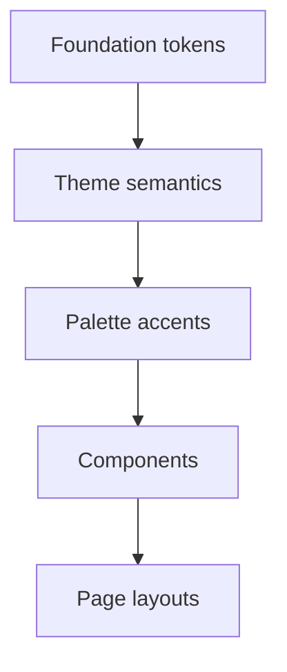

# Theme integration

## Visual contract

LabFlow uses semantic tokens so components describe purpose instead of choosing isolated colors. Content defaults to light while the application shell remains dark. Eight palettes tint accents and shell depth without changing scientific status meanings.

Typography is local-only: the UI uses the operating system’s system font stack and a local monospace stack. No font file, stylesheet or icon is requested from a CDN. Icons are shared inline SVG paths with consistent stroke, cap and join treatment.


The checked-in identity uses the LF workflow monogram: the navy path establishes structure, the muted green pipette/flow element signals laboratory work, and the final node represents a traceable result. `logo-mark.svg` is used in the application shell, `favicon.svg` is the compact browser mark, and `logo-horizontal.svg` is the primary wordmark. All variants are local SVG assets and remain independent from the selectable interface palettes.

## First-paint order

The theme controller must run before the stylesheet:

```html
<html data-theme="light" data-palette="blue" data-density="compact">
<script src="ui/theme-controller.js"></script>
<link rel="stylesheet" href="ui/theme.css">
```

The controller validates carried `lf_theme`, `lf_palette` and `lf_density` parameters and applies them synchronously to the root element. CSS is then evaluated against the correct attributes on the first paint, preventing a light/dark flash during internal navigation. It performs no persistence, file operation or network request.

## Semantic tokens

Standalone consumers should use `--bg`, `--surface`, `--surface2`, `--text`, `--muted`, `--subtle`, `--line`, `--accent`, `--accent-soft`, `--success`, `--warning`, `--danger` and `--info`. Shell, report-paper and layout tokens are specialized groups. Theme components must never depend directly on a particular palette value.



## Diagrams and icons

The diagram renderer consumes the same semantic surface, text, line and accent tokens as the rest of the UI. SVG arrows and nodes remain legible in both themes. Downloaded SVG contains geometry and classes but no external resource.

Icons are decorative when paired with text and therefore use `aria-hidden`. Icon-only buttons require an accessible label. Search uses a dedicated 18-pixel optical size and stronger stroke because it appears on the dark topbar at compact density.

## Integration rules

Load `ui/theme.css` for the portable theme package or `ui/ui.css` for the complete application system. Set all root attributes even when using defaults. Keep the controller before CSS when appearance may be carried in the URL. Do not import application components into a minimal theme consumer.

The standalone example in `examples/theme-integration.html` demonstrates local theme switching without exposing repository internals as product navigation.

## Verification

Check light and dark themes, all palettes, both densities, focus states, status contrast, report-paper contrast, graph edges and text, and a cross-page navigation sequence. With reduced motion enabled, no required information may depend on animation.
