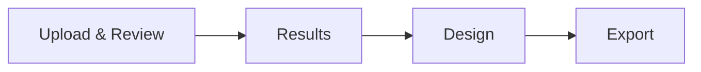

# UI contract

LabFlow uses one researcher workflow and one visual system. Feature pages may compose shared primitives; they must not invent a second design language.

## Primary workflow

The primary scientific navigation is:

Cabinet, Knowledge Base, Settings, Logs, Documentation and UI Kit are supporting workspaces. NOMAD is an export target, not a competing primary workflow.

## Ownership

- `assets/css/tokens.css` owns design tokens and shared sizing.
- `assets/css/ui.css` owns reusable controls, panels, badges, forms, tables and Totems.
- `assets/css/app.css` owns application/page composition and responsive layout.
- `ui-kit.html` plus `.agent/skills/labflow-ui/SKILL.md` are the implementation reference for shared patterns.

Do not create page-local copies of shared controls to solve isolated styling problems.

## Interaction primitives

Use Message Totem for feedback/confirmation and Action Totem for foreground execution progress/result. Inline notices are page content, not another overlay system.

Controls remain keyboard/touch usable and labels are associated with native controls. Long scientific names/paths use intentional wrapping/truncation rather than forcing document-level horizontal scrolling.

## Responsive behavior

Pages reflow their own workspaces. Shared scientific canvas density remains consistent; a narrow viewport should not become a horizontally scrolling desktop page.

Tables/data visualizations may have local scroll containers when the data genuinely requires it. Navigation tabs on narrow screens should reflow into compact grids where appropriate rather than relying on a long one-line scroller.

Assistant on mobile is a dedicated full-screen surface rather than a squeezed desktop sidebar.

## Themes

The instrument theme uses dark structural chrome around a light scientific canvas; the light theme keeps all regions light. Shared tokens define contrast and density. Assistant-contained Markdown, badges, code and structured output use Assistant surface tokens.

## Verification

After UI changes, run `validate_ui_contract.py`, unit tests and the responsive browser audit when available. Search for obsolete/duplicate selectors when replacing a shared pattern so stale late overrides do not resurrect the previous layout.
