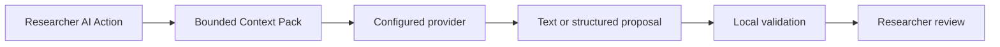

# AI assistance

LabFlow uses AI only where semantic interpretation or scientific writing adds value. Parsing, JV metrics, ranking, safe corrections, validation, and exports remain deterministic.

## Provider boundary

The Context Pack contains the current page, relevant canonical entities, compact results, findings, evidence, and bounded history. RAW curves and the full experiment are not sent by default.

## Configure a provider

1. Open **Settings → Provider**.
2. Choose Z.AI, OpenRouter, NVIDIA NIM, another built-in provider, or a compatible custom endpoint.
3. Enter the endpoint, model, and API key required by that provider.
4. Use **Detect** to load provider metadata, then run the connection test.

API keys remain in browser-local storage and are redacted from logs and diagnostics.

## Action behavior

One Action runs at a time. Checkpoints advance sequentially, retries are bounded, and the Totem exposes truthful progress. Stop cancels the active request; a terminal failure may expose **Retry checkpoint** when the Action contract allows it.

## Researcher authority

AI may propose missing Design fields, interpret already-computed Results, resolve genuine ambiguity, or draft prose. It must not recalculate deterministic metrics, decide NOMAD readiness, or silently mutate known and researcher-confirmed values.

