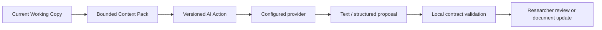

# AI assistance

LabFlow uses AI where semantic interpretation, reconstruction suggestions or scientific writing add value. Parsing, measured/derived metrics, ranking, safe deterministic corrections, validation and NOMAD readiness remain deterministic.

## The AI boundary



An AI provider never receives ownership of the Working Copy. It receives a request-specific projection and returns an output that LabFlow validates according to the Action contract.

## Where AI is used

### Automatic semantic enrichment

`analysis.enrich` may run after import when a provider is configured. It adds only a compact semantic layer to the Experiment Brief: likely goal, variables, useful comparisons, a few labelled hypotheses and important metadata gaps.

It is intentionally **optional, small and non-blocking**. Import remains valid without it.

### Resolve ambiguities

AI may propose evidence-backed resolutions for genuinely ambiguous records. Proposals are separate from applied corrections and can remain unresolved.

### Design suggestions

AI may suggest missing solution chemistry or device-stack information. Existing source/researcher values remain authoritative. Suggestions are stored separately until accepted.

### Results interpretation

AI may explain deterministic Results. It must not recalculate or replace those values.

### Report/Paper drafting

AI writes bounded Markdown work units from deterministic experiment context. The current editor remains the textual source of truth.

### Assistant

The Assistant receives current page context, relevant experiment evidence, bounded conversation history and optional local Knowledge Base matches. It is read-only with respect to scientific state.

## Configure a provider

1. Open **Settings → Provider**.
2. Select the provider.
3. Enter the provider endpoint/model and API key when required.
4. Use **Inspect/Detect** only when applicable to that provider.
5. Run **Test AI connection**.

The connection test is deliberately tiny and contains no experiment data. Its purpose is to test endpoint/key/model reachability, not scientific capability.

## Provider/model capacity vs LabFlow budgets

A model may advertise a very large context/output window. LabFlow does not automatically use it.

Every AI Action declares its own:

- `max_input_tokens`;
- `target_output_tokens`;
- `max_output_tokens`;
- deadline;
- semantic retry policy.

Provider throttles never trigger a hidden HTTP retry. They open the provider cooldown and return control to the researcher.

See [AI tokens, limits and rate limiting](AI_TOKENS_AND_RATE_LIMITS.md) and the generated [Action runtime matrix](../reference/ACTION_RUNTIME_MATRIX.md).

## Z.AI GLM-4.7-Flash policy

LabFlow does not fall back to another model.

For `glm-4.7-flash`, a 429/`1305` opens a shared provider cooldown. LabFlow sends no hidden retry, stops multi-request sequences, preserves completed work and blocks new provider calls until the circuit expires. Repeated throttles extend the cooldown, while a later successful request clears the exponential failure history.

The client-side spacing/circuit values are defensive LabFlow policy; they are not presented as official provider rate limits.

## Local providers

LM Studio, Ollama and llama.cpp (`llama-server`) use the same OpenAI-compatible Action/transport path. This makes them useful for diagnosis:

- HTTP 200 + valid output means the Action pipeline is working;
- HTTP 200 + `MODEL_OUTPUT_TRUNCATED` means the model hit the Action output ceiling;
- CORS/network failure means the browser cannot reach the local endpoint;
- remote 429 while local succeeds isolates a remote-provider problem from deterministic LabFlow import.

## Researcher authority

AI may infer, explain, propose and draft. It must not:

- silently rewrite RAW source;
- replace deterministic measurements;
- overwrite researcher-confirmed values without an explicit action;
- invent precise missing fabrication quantities as facts;
- decide NOMAD readiness;
- treat retrieved Knowledge Base content as proof that a method was performed in the experiment.

## llama.cpp preset

The dedicated **llama.cpp (local)** provider defaults to `http://127.0.0.1:8080/v1`. LabFlow sends normal OpenAI-compatible Chat Completions requests to `/v1/chat/completions`, reads served model IDs from `/v1/models`, and reads runtime context/slot metadata from `/props`. No cloud API key is attached. For Actions that request `thinking: off`, LabFlow sends llama.cpp-compatible per-request controls (`reasoning_effort: none`, `reasoning_budget: 0`, and `chat_template_kwargs.enable_thinking: false`).

LabFlow's recommended runtime profile is deliberately **one slot with the full 65K context**. A LabFlow-oriented launcher looks like:

```bash
llama-server \
  --model /path/to/model.gguf \
  --ctx-size 65536 \
  --parallel 1 \
  --n-gpu-layers 99 \
  --flash-attn on \
  --cache-type-k q4_0 \
  --cache-type-v q4_0 \
  --jinja \
  --host 127.0.0.1 \
  --port 8080 \
  --timeout 600 \
  --sse-ping-interval 15
```

Reasoning is intentionally **not disabled globally** in this launcher. LabFlow applies reasoning policy per Action: most structured Actions currently request `thinking: off`, while Actions that intentionally require reasoning can leave it enabled. After startup, **Detect** should report `65,536 context tok / 1 slot` and mark the LabFlow llama.cpp runtime profile as active. If `/props` reports another value, LabFlow uses the effective `n_ctx` exactly as reported and flags the runtime profile mismatch; it never divides that value a second time.

**Detect** reads `/v1/models` and `/props` separately. The served API ID remains the value sent in requests. When `/props` exposes a model path/name, Settings shows its filename as **Runtime model**; otherwise it says **not exposed by server** instead of guessing.

The Settings **Test connection** intentionally separates connectivity from final-answer quality. If llama.cpp returns HTTP 200 with a valid Chat Completions envelope but spends the tiny probe budget entirely in reasoning, LabFlow reports **reachable · final-text probe inconclusive**. That is not treated as a network failure. Normal scientific Actions do **not** get this exception: they must still produce final content that passes their parser/schema contract.

LabFlow intentionally treats llama.cpp structured output conservatively: JSON mode may be requested, but every structured Action is still parsed and validated locally against the LabFlow schema before anything can be stored.
