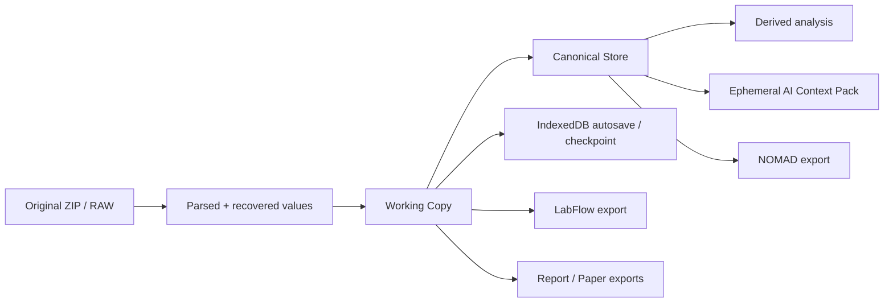

# Data lifecycle and provenance

LabFlow uses several representations of an experiment, but only one of them is editable scientific state.

## Lifecycle at a glance

## RAW source

The original archive is immutable. LabFlow keeps the source bytes and paths for provenance and round-trip export. RAW data are never corrected in place.

A correction therefore means: **the Working Copy now contains a reviewed interpretation that differs from, or supplements, the source evidence**. The source remains available to explain why that interpretation exists.

## Parsed and recovered values

A parsed value is read directly from a known source format. A recovered value is reconstructed deterministically from another RAW representation when the primary representation is unavailable or incomplete.

Recovery must be explainable by a rule. If two sources conflict and the winner is not deterministic, the conflict becomes a finding instead of a guess.

## Working Copy

The Working Copy contains the current editable experiment. It includes scientific entities and experiment-scoped derived state such as:

- samples and measurements;
- Design entities;
- findings and patches;
- Experiment Brief;
- Report/Paper state;
- NOMAD staging/readiness state;
- provenance required to reconstruct how the current interpretation was reached.

Scientific mutations advance the Working Copy revision.

## Canonical Store

The Canonical Store makes the Working Copy semantically searchable. It exposes stable IDs, aliases and relations such as sample → measurement or measurement → file.

It is rebuilt from current state and must not become an independent source of truth.

## Analysis Dossier and Experiment Brief

The Analysis Dossier is a compact deterministic view of the current revision: counts, quality, rankings, findings, correction opportunities and evidence coverage.

The Experiment Brief is a smaller shared summary used by later pages and AI Actions. It has two layers:

- `deterministic` — authoritative compact facts;
- optional `ai` — provenance-marked semantic enrichment.

AI enrichment is invalidated when relevant scientific inputs change. Merely rewriting Report prose does not invalidate scientific interpretation.

## Context Packs are temporary

An AI Context Pack is assembled for one request. It is bounded and request-specific. It may include a current selection, compact Results, relevant findings/evidence, Design state, a small Knowledge Base slice and bounded chat/document context.

A Context Pack is **not** a persisted substitute for the experiment. The model receives only what the current Action requires.

## Browser persistence

LabFlow is local-first, not memory-only.

- the current Working Copy/source snapshot is autosaved in **IndexedDB**;
- explicit **Save** marks a checkpoint revision;
- provider/model preferences and provider-scoped API keys live in browser-local storage;
- provider rate-limit/cooldown state is not stored in the scientific session or persisted across reloads;
- reset clears the persisted scientific session while preserving provider/UI preferences unless explicitly changed.

## Exports

Exports are derived artifacts.

**LabFlow ZIP** contains a durable current-state package and canonical snapshot. **Report/Paper** exports use current Markdown and selected deterministic figures. **NOMAD ZIP** uses the deterministic mapping/readiness pipeline.

Exporting does not mutate RAW and does not imply that later edits are saved.

## Provenance vocabulary

Use these concepts consistently:

- **RAW** — exact source evidence;
- **Parsed** — deterministic read from RAW;
- **Derived** — deterministic calculation;
- **Recovered** — deterministic reconstruction from another RAW representation;
- **AI inferred/proposed** — model output awaiting appropriate review;
- **User confirmed** — researcher-reviewed interpretation;
- **Missing** — unavailable and not safely recoverable;
- **Excluded** — deliberately omitted from a calculation with an explicit reason.
