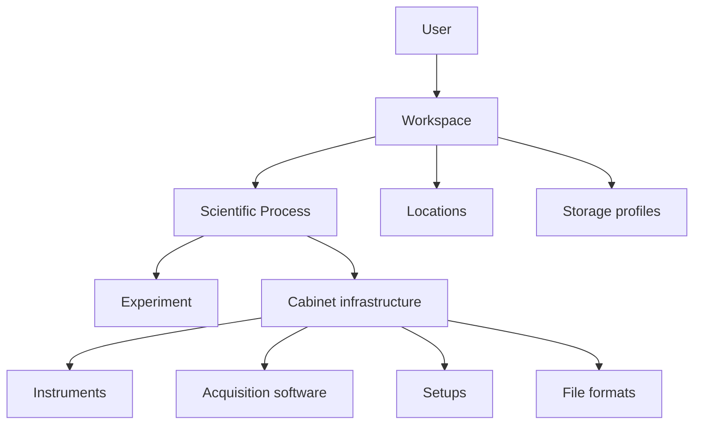

# Workspace data management

LabFlow separates **experiment evidence** from the reusable context that explains how laboratory data is normally generated and managed.

## Workspace

Use **Settings → Workspace** for information that is stable across many experiments: institution, data responsible, parser contact, test locations and the normal storage environment. Credentials never belong in these fields.

The researcher profile is separate. The person currently using LabFlow is not necessarily the person responsible for project data or parser development.

## Scientific Process

A Process describes one reusable data-generating workflow. Examples are JV characterization, stability tracking, PL mapping, XRD characterization or a simulation pipeline.

A Process can declare:

- the sample types it accepts;
- controlled variables/settings;
- measured/derived observables;
- usual measurement frequency and output size;
- parallel setup capacity;
- locations and storage profiles;
- instruments, acquisition software, setups and output formats from Cabinet;
- where sample metadata is recorded;
- the rule used to link output files to samples.

Variables and observables use explicit names and units. In the compact editor, one quantity is entered per line as `Name | unit | description`.

## Process versus Design process

They are intentionally different concepts. A Workspace Process describes the reusable scientific workflow that generates data. `Design.process` describes fabrication details of a particular experimental device, such as coating, annealing and atmosphere.

## Measurement provenance

Measurements retain the current JV fields for deterministic JV analysis, but also expose a general envelope: technique, parameters, observables, setup/instrument/software/location references and sample-linkage evidence. This allows future parsers to add other techniques without changing the Sample → Run → Measurement hierarchy.

## Portability and privacy

A normal LabFlow save contains `workspace.json` with the reusable scientific context, but contact names and email addresses are redacted by default. The explicit **Export data-management profile** action in Settings is intended for researcher-controlled sharing of the full project questionnaire/profile.

## Relationship to Design reference data

Workspace/Process describes the expected data-generating environment, while Cabinet and KB can also support Design reconstruction. These roles must not be conflated:

- Workspace/Process: normal institutional/setup context;
- Cabinet: reusable lab-specific definitions/resources;
- KB: sourced general scientific reference;
- Experiment Design: accepted experiment-specific scientific description.

A Process reference to an instrument/setup does not prove that a specific Measurement used it, and a Cabinet/KB Design candidate does not prove that a specific device used that recipe. Concrete experiment provenance must remain explicit.
