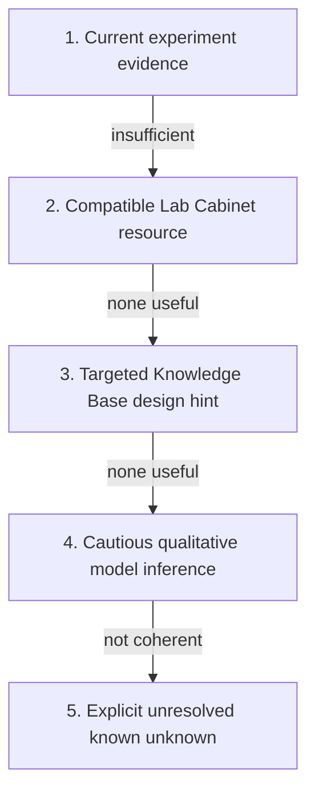
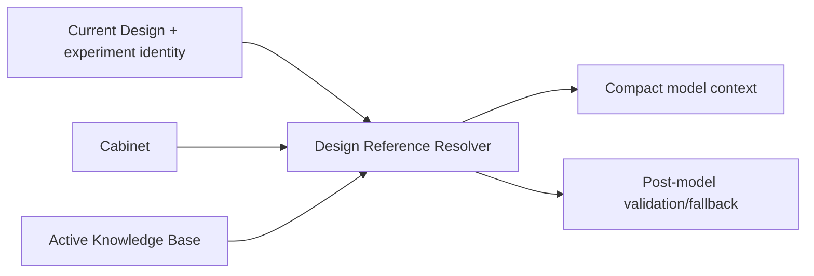

# Design inference and confidence

`design.infer` helps reconstruct missing experiment-specific **solution chemistry**, **device stack** and **fabrication process**. It is a proposal system, not an automatic scientific truth generator.

The implementation is deliberately designed to behave usefully with both small local models and stronger hosted models. The model is allowed to synthesize a proposal, but LabFlow owns the context, source labels, semantic validation, reference fallback, confidence calibration and final application rules.

## Source hierarchy

For every missing Design domain, LabFlow uses this order:



The order is an **authority hierarchy**, not merely a retrieval order.

| Nature of the choice | `provenance_kind` | Meaning | Typical LabFlow confidence baseline | Automatic application |
|---|---|---|---:|---|
| experiment evidence | `experiment` | supported by current experiment/source evidence | 0.97 when directly supported; 0.90 otherwise | possible for sufficiently supported fields |
| Lab Cabinet reference | `cabinet_reference` | compatible researcher-curated reusable lab definition | 0.86 | no; review required |
| Knowledge Base reference | `knowledge_reference` | sourced general/reference candidate | 0.74 | no; review required |
| model inference | `model_inference` | qualitative synthesis not backed by a specific supplied reference | 0.52 | only under the existing conservative qualitative rules |
| unresolved | `unresolved_domains` | no coherent candidate should be asserted | not a candidate | no |

These baseline values are implementation defaults, not universal scientific probabilities.

## What the confidence percentage means

The percentage shown in the Design suggestion is **candidate confidence**: LabFlow's calibrated confidence that a proposed value is a reasonable candidate to review for the current missing field.

It does **not** mean:

- probability that the current experiment actually used the proposed material or process;
- statistical confidence interval;
- model accuracy score;
- evidence strength equivalent to a measurement;
- permission to treat Cabinet/KB content as current-experiment evidence.

For each field LabFlow combines a provenance-specific baseline with the model/provider-reported confidence when available. The current calibration uses approximately 70% provenance baseline and 30% reported confidence, then applies a source-specific cap. This deliberately prevents a model from converting an unsupported `0.99` into authoritative-looking certainty.

```text
calibrated = 0.70 × source_baseline + 0.30 × reported_confidence
```

The result is capped by source nature:

- experiment evidence: `0.99`;
- Cabinet reference: `0.91`;
- KB reference: `0.82`;
- model inference: `0.62`.

An exact quantitative value without direct experiment support is additionally capped at `0.45`. Unsupported quantities therefore remain review-only even when the model emits a high confidence.

At proposal-card level, unresolved domains reduce the displayed overall confidence so a partly useful proposal is not visually confused with a fully supported one.

## Cabinet-aware completion

Design inference receives a short per-domain Cabinet subset instead of the whole Cabinet:

- `solutions` → valid Cabinet `solution` resources;
- `stack` → valid `stack`, `substrate` and relevant `material` resources;
- `process` → valid Cabinet `protocol` resources.

When a Cabinet resource materially supports the proposal, the item is labelled `cabinet_reference` and evidence contains its exact marker:

```text
CABINET:<id>
```

The marker records the **nature and origin of the choice**. It is not evidence that the resource was used in the current experiment.

If the model omits a domain but a valid, compatible Cabinet resource is available, LabFlow can construct a deterministic review candidate from that resource before falling back to `unresolved`.

## Knowledge Base-aware completion

KB retrieval is also per domain. Only active, validated, sourced entries are eligible.

Design-oriented entries may contain a structured `design_hint` with one or more of:

- `solution` — qualitative formulation components;
- `stack[]` — coherent device architecture layers;
- `process` — qualitative fabrication family;
- `reference_confidence` — author-curated prior for that reference candidate;
- a caution/note explaining what remains unknown.

A Design candidate materially derived from such an entry uses:

```text
provenance_kind = knowledge_reference
evidence = KB:<id>
```

LabFlow verifies the referenced KB ID. An invented or unavailable ID is downgraded to `model_inference` rather than being granted false citation authority.

## Design Reference Resolver

Starting with `0.0.20`, Design references are resolved through a deterministic path that is independent from the model prompt budget. This closes an important failure mode seen on larger experiments: a generic Context Pack could be compacted enough to preserve the model request while dropping the very `knowledge.domain_candidates` later needed by semantic fallback.

The resolver now computes one small per-domain reference set directly from the current experiment, Cabinet and active Knowledge Base:



The model and the validator therefore see the **same logical reference candidates**, but the validator does not depend on the already-compacted model Context Pack. Even if a small model returns an empty domain or explicitly marks it unresolved, a usable structured Cabinet/KB candidate can still become a review-only proposal.

Under severe prompt compaction, LabFlow preferentially removes generic experiment detail before removing these structured Design candidates. This is deliberate: measurements and source evidence remain authoritative elsewhere, while the Design Action specifically needs a bounded set of reusable qualitative references.

## Deterministic reference fallback

Small models sometimes return valid JSON but omit a domain even when the supplied references contain a good candidate. LabFlow does not immediately convert that omission to an empty Design.

After model normalization, the runtime attempts a deterministic reference fallback:

1. use a valid Cabinet candidate when available;
2. otherwise use an eligible structured KB `design_hint`;
3. otherwise preserve a coherent qualitative model proposal;
4. only then mark the domain unresolved.

The fallback never invents numeric conditions, concentrations, thicknesses, ratios, times or temperatures. It only materializes already supplied structured reference content.

The proposal records which domains were created through this path in `validation.referenceFallbackDomains`.

## Unresolved domains and workflow completeness

A scientifically unknown field is not the same thing as an unfinished workflow.

If no responsible candidate can be formed, the domain is recorded in `unresolved_domains`. After researcher acceptance, LabFlow stores that gap as an acknowledged known unknown. The Design may therefore be **Reviewed** even while some scientific details remain unknown.

This prevents an infinite “Complete with AI” loop while preserving the fact that the scientific information is missing.

If the researcher later edits that domain, its acknowledgement is invalidated and the domain can become pending again.

## Small-model robustness

The model does not receive the raw JSON Schema. Instead it receives a compact data-instance contract. This avoids a common failure where small models copy schema keywords such as `additionalProperties` into the answer.

LabFlow also performs bounded transport-only repair for common non-JSON literals outside strings:

```text
True  → true
False → false
None  → null
```

This repair changes syntax only. It never repairs or invents scientific content.

A valid but sparse answer is normalized and reference-backed where possible. A malformed response can still be retried or rejected according to the Action contract.

## Large-model behavior

A stronger model receives the same authority boundaries. It may synthesize a better candidate from several pieces of context, but it cannot upgrade Cabinet or literature knowledge into experiment evidence.

A large model is therefore expected to improve **candidate quality**, not to bypass provenance, validation or review.

## Acceptance

A stored proposal remains outside accepted Design until the researcher accepts it. Application occurs through `DesignModel`, never by arbitrary Action/UI mutation.

When accepted:

- existing researcher values are not silently overwritten;
- review-only Cabinet/KB candidates remain visibly sourced;
- unresolved domains become acknowledged known unknowns;
- applied source/provenance survives in the experiment-owned Design snapshot.

## Debugging

Useful diagnostics for a Design run include:

- `context.design_evidence_summary`;
- `context.cabinet.domain_candidates`;
- `context.knowledge.domain_candidates`;
- proposal `provenance_kind` and `evidence` markers;
- `selection_basis`;
- `reported_confidence` and calibrated `confidence`;
- `validation.referenceFallbackDomains`;
- `validation.autoUnresolvedDomains`;
- Action retry/structured-parser diagnostics.

A proposal that contains only unresolved domains is valid only when the Design Reference Resolver also has no usable candidate. If `design_evidence_summary.knowledge_domains` reports candidates but the stored proposal remains empty, treat that as a resolver regression. The unit suite includes a real-bundle regression with an empty Cabinet to prevent this class of bug from returning.
