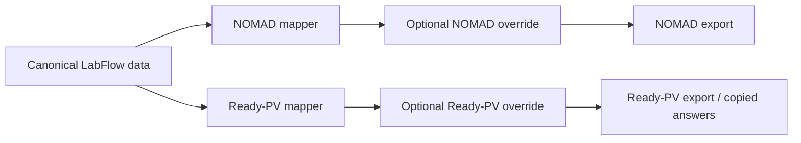

# Export projections: NOMAD and Ready-PV

LabFlow 0.0.23 presents NOMAD and Ready-PV side by side on the Export page. They are **projections** of the same canonical LabFlow data, not parallel scientific databases.

## Source-of-truth rule

ExperimentData, Workspace, Process and Lab Cabinet remain authoritative inside LabFlow. Editing a value in either export column creates an **export-only override**. It does not rewrite ExperimentData, Workspace, Process or Cabinet.

An override can always be reset to the canonical value. NOMAD overrides are used by the generated NOMAD projection and archive YAML. Ready-PV overrides are used by the Ready-PV JSON and copied questionnaire answers.

## NOMAD projection

The NOMAD column is primarily experiment scoped. It combines the current ExperimentData with Workspace/Process context and shows grouped fields for entry/context, samples, measurements/results, setup/formats and files/provenance.

Each row shows its source nature, such as `EXPERIMENT`, `WORKSPACE`, `PROCESS`, `DERIVED` or `OVERRIDE`. The existing NOMAD package validation remains authoritative for blocking issues. The displayed readiness percentage is a deterministic completeness indicator; it is not a scientific confidence score.

Exports available from the projection are JSON and archive YAML. The existing NOMAD staging ZIP remains available below the projection workbench.

## Ready-PV projection

The Ready-PV column follows the data-management questionnaire structure:

- contact information;
- measured quantities;
- samples and setup;
- instruments and file formats;
- storage;
- metadata/documentation;
- additional remarks.

The mapper preferentially uses Workspace and Process definitions, then Cabinet references for instruments/software/formats, then deterministic information from the current experiment when an appropriate Workspace/Process field is absent.

The projection can be exported as JSON or copied as plain questionnaire answers for pasting into the Ready-PV form.

## Readiness

Readiness is deterministic and based on populated required/recommended projection fields. It is not the same concept as AI confidence and must never be interpreted as probability that a scientific claim is true.

Missing required and recommended fields remain visible. Optional fields do not lower readiness.

## Privacy

Ready-PV contact fields can contain personal names and email addresses because the questionnaire explicitly requires them. These values are shown only in the Ready-PV projection/export path. Ordinary scientific exports continue to redact contacts unless the user explicitly chooses a contact-bearing data-management export.
