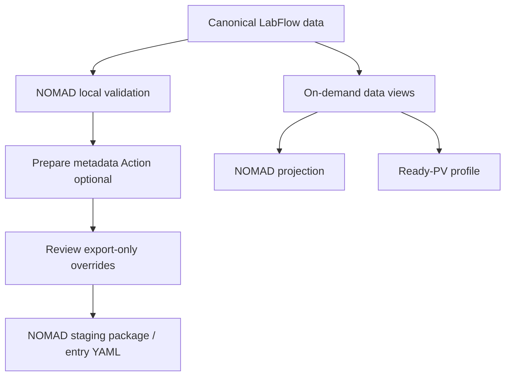

# Export: NOMAD-first workflow and on-demand projections

LabFlow 0.0.24 makes **NOMAD staging/export the primary Export-page workflow**. NOMAD and Ready-PV remain projections of the same canonical LabFlow data, but their detailed fields are now secondary inspection tools and stay collapsed until the researcher opens them.

## Page hierarchy

The first screen answers three questions:

1. Is the current experiment ready to stage for NOMAD?
2. What blocks or warns the export?
3. What is the next concrete action?

Detailed NOMAD and Ready-PV values are inside closed disclosure panels. Section-level data is also collapsed. This avoids turning Export into a wall of metadata while preserving full inspectability and optional editing.

## Source-of-truth rule

ExperimentData, Workspace, Process and Lab Cabinet remain authoritative. Export views are deterministic projections. Manual edits and accepted AI metadata suggestions create **export-only overrides** and do not rewrite canonical scientific state.

## `export.prepare` Action

`export.prepare` (`/prepare-export`) is a review-only metadata preparation Action. It is available when required or recommended projection fields are missing.

The Action receives a bounded Export context containing:

- current NOMAD validation/mapping state;
- only the currently missing projection fields that may be suggested;
- Workspace and Process context;
- bounded Cabinet resources;
- bounded Knowledge Base references;
- current persisted Action outputs.

The model may suggest only field ids explicitly listed in `allowed_fields`. The runtime validator drops suggestions for populated or unknown fields and calibrates confidence by source nature. Unsupported metadata remains unresolved rather than invented.

Accepted Action output is applied only through the explicit **Apply export overrides** control.

## Source nature and confidence

Each suggestion declares its strongest basis:

- `experiment`;
- `workspace`;
- `process`;
- `cabinet_reference`;
- `knowledge_reference`;
- `model_inference`.

Confidence is the reliability of the proposed export representation given the supplied context. It is not proof that an unobserved scientific fact is true. Runtime source caps prevent model-declared confidence from overstating weak provenance.

## NOMAD projection

The NOMAD data view remains experiment scoped and combines ExperimentData with Workspace/Process context. It can be opened to inspect grouped fields, mapping details and machine-readable JSON/YAML. Local NOMAD validation remains authoritative for blockers.

## Ready-PV projection

Ready-PV remains secondary to NOMAD on this page and follows the questionnaire structure: contacts, quantities, samples/setup, instruments/formats, storage, metadata/linkage and remarks. It preferentially uses Workspace/Process/Cabinet definitions, with deterministic experiment fallbacks where appropriate.

## Readiness

Readiness is a deterministic completeness score over required/recommended fields. It is not an AI confidence score and must not be interpreted as probability that scientific claims are correct.

## Assistant behavior

On Export, the Assistant prioritizes NOMAD blockers and the smallest useful next step. When `export.prepare` is available, it may recommend `/prepare-export`. It should not dump the entire projection or fabricate metadata to improve readiness.

## Direct upload

Local NOMAD staging/export is implemented. Direct browser upload remains a separate connector boundary and is still explicitly marked as not implemented. No token or data is sent by the upload stub.
