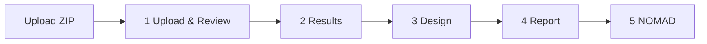

# Start with LabFlow

LabFlow is a local-first workbench for turning one laboratory ZIP into reviewed Results, an explicit experimental Design, scientific documents and a validated NOMAD package.

> The uploaded ZIP is immutable source evidence. Every correction and edit applies only to the Working Copy.

## The five-step workflow

The workflow bar is navigation, not five independent copies of the experiment. Every step reads the same current Working Copy.

## First successful run

1. Open **Upload & Review** and choose the original ZIP.
2. Wait for deterministic import and analysis to complete.
3. Review source receipt, warnings, findings and proposed safe corrections.
4. Inspect **Results** before filling missing Design information.
5. Complete **Design** manually or review AI suggestions.
6. Draft/edit **Report** or Scientific Paper from the current experiment state.
7. Resolve required **NOMAD** mappings and prepare the package.
8. Use **Save** for an explicit browser checkpoint and **Export ZIP** for a durable LabFlow package.

## What happens during import

Import itself does not require AI. LabFlow inventories the ZIP, parses known formats, resolves canonical identities, reconstructs deterministic data where safe, calculates Results and builds the deterministic Experiment Brief.

If an AI provider is configured, a small internal `analysis.enrich` Action may then add optional semantic context. Failure, truncation or provider throttling never blocks the deterministic import.

## What stays local

The following run in the browser:

- ZIP parsing and recovery;
- scientific calculations and ranking;
- canonical identity/evidence construction;
- validation and safe corrections;
- Working Copy autosave in IndexedDB;
- Report/Paper/NOMAD export generation;
- Knowledge Base search.

Only explicit/declared AI Actions send bounded Context Packs to the selected provider. API keys and provider preferences remain browser-local.

## If AI is unavailable

LabFlow should still support the core scientific workflow. You can import, review, inspect Results, edit Design manually, write documents manually and prepare deterministic NOMAD mappings without a working external model.

This is intentional: AI is an assistive layer, not the runtime foundation.

## Continue reading

- [How LabFlow works](HOW_LABFLOW_WORKS.md)
- [Research workflow](RESEARCH_WORKFLOW.md)
- [Data lifecycle and provenance](DATA_LIFECYCLE.md)
- [AI assistance](AI_ASSISTANCE.md)
- [AI tokens, limits and rate limiting](AI_TOKENS_AND_RATE_LIMITS.md)
- [Troubleshooting](TROUBLESHOOTING.md)
