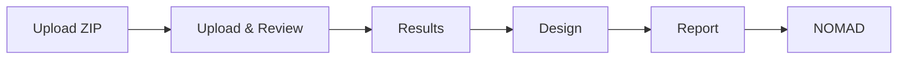

# Start with LabFlow

LabFlow is a local-first workbench for turning one laboratory ZIP into reviewed results, an explicit experimental design, scientific documents, and a validated NOMAD package.

> The uploaded ZIP is immutable source evidence. Every correction and edit applies only to the Working Copy.

## The workflow

## First successful run

1. Open **Experiment** and choose the original ZIP.
2. Review the source receipt and deterministic findings.
3. Apply only corrections whose evidence you understand.
4. Inspect Results before completing Design.
5. Write or generate the Report.
6. Resolve required NOMAD fields and download the staging package.
7. Use **Save** for a browser checkpoint and **Export ZIP** for a durable Working Copy package.

## What stays local

Parsing, scientific calculations, validation, Working Copy autosave, and export generation run in the browser. A configured AI provider receives data only when an explicit AI Action runs or when automatic import enrichment is enabled.

## Continue reading

- [Research workflow](RESEARCH_WORKFLOW.md)
- [AI assistance](AI_ASSISTANCE.md)
- [Privacy and provider boundary](../PRIVACY.md)
- [Data formats](../data/DATA_FORMAT.md)

