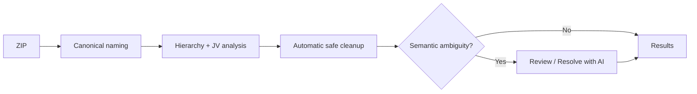

# Start with LabFlow

## Shortest workflow

1. Open **Upload & Review**.
2. Drop/select the experiment ZIP.
3. Let LabFlow normalize names, rebuild hierarchy, analyze data and perform safe automatic cleanup.
4. If Review says **Scientific decisions: Clear**, go directly to **Results**.
5. If ambiguities remain, click **Resolve with AI**, inspect the suggestions and optionally **Apply all suggestions**.
6. Use **Design** or **Export** when needed. NOMAD artifacts live inside Export.

That is the intended normal workflow. Researchers should not have to understand the internal pipeline to get trustworthy deterministic Results.

## What happens automatically



## During import

LabFlow performs no AI request. It automatically:

- preserves RAW evidence;
- identifies canonical names;
- creates Experiment/Sample/Run/Measurement relationships;
- parses and pairs FW/RV JV data;
- calculates deterministic metrics/results;
- excludes only mechanically proven invalid ranking records in the LabFlow Data;
- records automatic corrections in provenance;
- checks structural invariants.

## AI is optional

Without any provider configured you can still import, review deterministic findings, inspect Results, edit/confirm Design manually and prepare deterministic export data.

AI is a convenience for ambiguity resolution, Design suggestions, Results interpretation/comparison and questions.

## Useful console command

```js
LabFlow.Data.help()
```

This documents the exact live data object used by the application.
