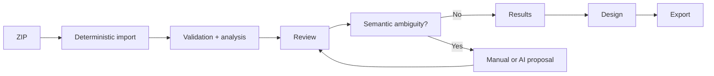

# Start with LabFlow

The normal workflow is intentionally short. A researcher should not need to understand internal pipeline mechanics before obtaining deterministic Results.

## Shortest workflow

1. Open **Upload & Review** and select the laboratory ZIP with **Choose ZIP file** or by dragging it onto the upload card.
2. Let LabFlow preserve RAW evidence, normalize names, rebuild the hierarchy and calculate deterministic analysis.
3. Review any mechanically safe correction that is still pending; LabFlow Data changes only after explicit acceptance.
4. If **Scientific decisions** is clear, continue directly to **Results**.
5. If a genuine semantic ambiguity remains, resolve it manually or run **Resolve with AI**, inspect the proposal and accept only the changes you agree with.
6. Complete or verify **Design**. Cabinet resources may be copied into Design; optional AI inference produces a reviewable proposal rather than an automatic mutation.
7. Use **Export** for the portable LabFlow package and deterministic NOMAD-oriented artifacts.



## What happens automatically

Import does not require an AI provider. LabFlow preserves the uploaded source, establishes Experiment/Sample/Run/Measurement relationships, parses and pairs FW/RV JV data, computes deterministic metrics, records structural findings and prepares review state.

Mechanically detectable cleanup may be proposed automatically, but a pending mutation is not silently committed. Genuine ambiguity remains visible rather than being guessed.

## AI is optional

Without a provider configured you can still import data, review findings, inspect Results, edit Design, use Cabinet/Knowledge Base features and prepare deterministic exports.

AI is reserved for explicit Actions and Assistant questions where interpretation or semantic inference is useful. Its output remains non-authoritative until the relevant owner-controlled acceptance step.

## Reset session

**Reset session** enables only when LabFlow has session-owned work to clear: an imported experiment/RAW snapshot, revisions or review state, Design, Action proposals/history, chat, export overrides, or relevant transient workflow state. Reset clears that work and the saved workspace. Provider configuration, API credentials, theme, Workspace, Cabinet, Knowledge Base and other intentionally persistent preferences remain. Those settings alone do not enable Reset.

## Useful console command

```js
LabFlow.Data.help()
```

It documents the live data surface used by the application. For ownership and mutation boundaries, continue with [Architecture](../ARCHITECTURE.md) or the [research workflow](RESEARCH_WORKFLOW.md).
