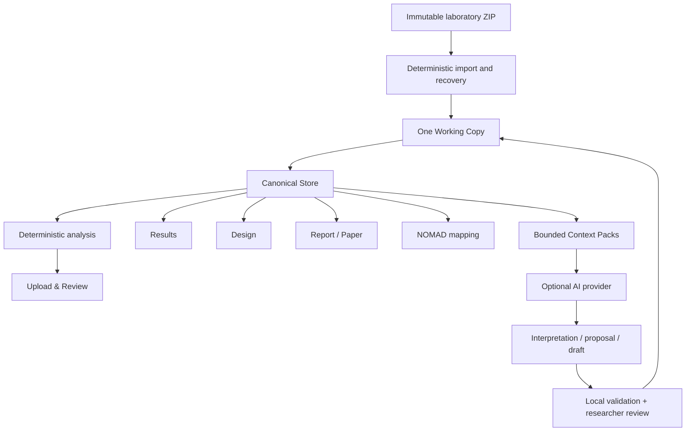

# How LabFlow works

LabFlow is designed around a simple question: **how can a researcher move from messy laboratory files to a reviewed, traceable experiment without allowing convenience features to silently rewrite the scientific evidence?**

The answer is a one-way source boundary, one editable Working Copy and a deterministic-first workflow.

## The complete picture

The arrows matter. AI receives selected context **from** LabFlow and returns a proposal **to** LabFlow. It does not own the experiment state.

## 1. Import is evidence acquisition

When a ZIP is selected, LabFlow clones the source bytes and inventories the archive. Known file families are parsed deterministically. Naming rules, internal metadata and directory evidence are used to construct canonical sample identities while preserving original filenames as provenance aliases.

Import may recover information from redundant deterministic sources—for example summary files or individual JV files—but it does not ask AI to decide what a measured value should have been.

The result is the first Working Copy revision plus an immutable source receipt.

## 2. The Working Copy is the only scientific state you edit

LabFlow intentionally avoids page-specific scientific copies. The current experiment is the Working Copy. Manual edits, accepted corrections, Design changes and document state all point back to it.

This is what makes later Results, Report and NOMAD views consistent: they are different views of the same current experiment, not disconnected workflows.

Autosave stores this Working Copy in IndexedDB so an interrupted browser session can be restored. **Save** marks an explicit checkpoint. **Export ZIP** creates a durable file. None of these operations alter the original upload.

## 3. The Canonical Store makes messy data addressable

The Canonical Store is a deterministic semantic index over the Working Copy. It provides stable IDs, aliases, relations, evidence references and compact retrieval helpers.

It solves a common laboratory problem: the same real sample may appear under slightly different filenames or in several measurement files. Canonical identity is therefore not equivalent to filename identity.

The Store is not another editable model. Rebuilding it must never create scientific divergence from the Working Copy.

## 4. Results are deterministic

JV metrics, ranking eligibility, grouping, reference/non-reference comparisons, quality flags and derived result summaries are calculated in JavaScript from parsed/recovered data.

AI can later **interpret** these Results, but the interpretation is downstream of the deterministic values. A model cannot replace the measured/derived numbers by producing more plausible ones.

## 5. Review separates four kinds of uncertainty

Upload & Review distinguishes:

- deterministic facts and warnings;
- mechanically safe corrections;
- genuine semantic ambiguities that may benefit from AI;
- unresolved questions requiring researcher judgment.

This separation is deliberate. A malformed encoding, for example, is not automatically an AI task; a genuinely ambiguous relationship between a filename and a scientific identity may be.

## 6. Design is explicit and reviewable

Design represents the experimental structure required by the POC, especially solution chemistry and device stack.

Existing source or researcher-confirmed values are authoritative. AI may suggest missing fields from experiment evidence, relevant Knowledge Base context and cautious model inference. Suggestions are visually separate and are not written into the Working Copy until accepted.

Bulk **Suggest all** is only an efficiency layer over the same principle. Work is divided into bounded batches and completed proposals are stored independently.

## 7. AI enrich is not a second analysis pass

After import, if AI is configured, `analysis.enrich` may add a small semantic layer to the Experiment Brief. Its job is intentionally narrow:

- likely experimental goal;
- important variables and controls;
- useful comparisons;
- a few observations/hypotheses;
- missing metadata that limits interpretation.

It does **not** calculate metrics, re-rank devices or decide scientific truth. The Action is fail-fast and non-blocking. If it fails, the deterministic Experiment Brief remains valid and import still completes.

## 8. Report and Paper are documents, not hidden analyses

LabFlow keeps a current Markdown source for Lab Report and Scientific Paper. AI writing Actions receive deterministic experiment context and write bounded document sections. The researcher can then edit the Markdown directly.

Export uses the current document text. It does not ask the model to regenerate a different narrative during PDF/DOCX export.

## 9. NOMAD is deterministic-first

A single Canonical → NOMAD mapping plan drives readiness, validation, generated metadata and package creation.

Missing required mappings block readiness. Optional missing data remain visible. AI may explain what a field means, but it does not decide whether the package is valid.

## 10. Why the architecture is deliberately conservative

Laboratory software benefits from convenience, but not from invisible state changes. LabFlow therefore prefers:

- explicit provenance over silent normalization;
- bounded context over sending the entire experiment;
- researcher acceptance over automatic AI writes;
- deterministic validation over model self-approval;
- resumable partial work over aggressive retry loops;
- local-first storage over a hidden backend.

That conservative logic is the core of LabFlow, not an implementation limitation.
