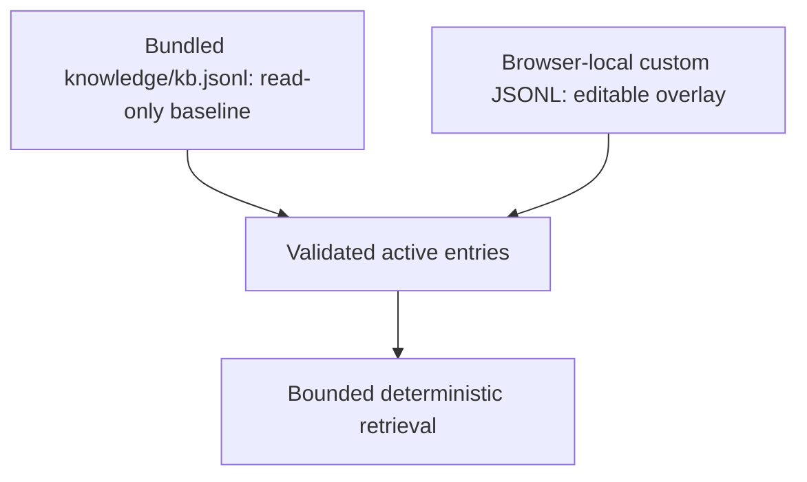

# Knowledge Base

The Knowledge Base provides curated reference knowledge to Assistant/Actions without introducing another database.

## Storage model

Custom entries can be exported/imported as JSONL. This keeps the data human-readable, versionable and easy to validate.

## Entry semantics

A KB entry can contain identity/type, title/aliases/tags, summary, facts, cautions, related IDs and source records. Validation rejects malformed records before they become active context.

## Authority boundary

KB content is reference knowledge, not evidence from the current experiment. If KB/reference knowledge conflicts with current source evidence or accepted LabFlow Data, experiment evidence wins.

When an Assistant answer relies on a retrieved KB entry, the model is instructed to append `[KB:<id>]`. The UI resolves that marker to stored source metadata. The model must not invent an ID, DOI, URL or citation.

## Editing safely

Prefer small factual entries with explicit cautions and source records. Avoid embedding transient UI instructions or experiment-specific claims in the KB; those belong in current scientific state/context instead.
