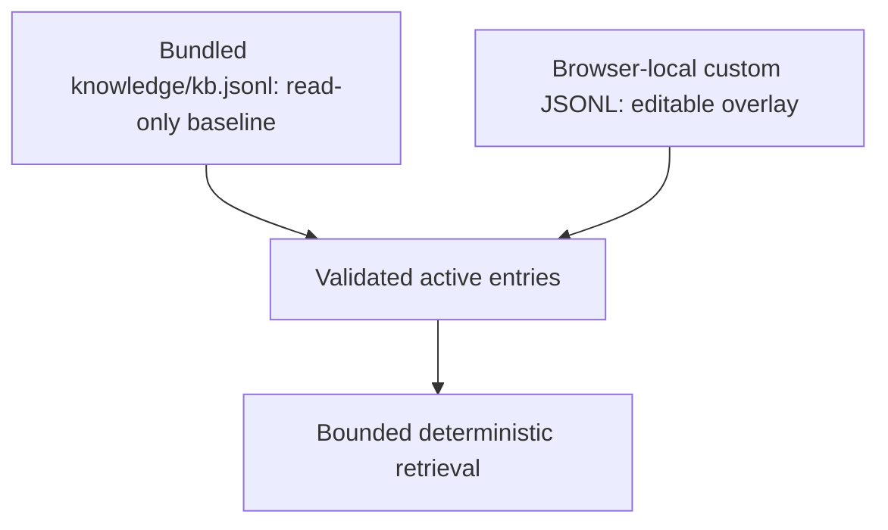

# Knowledge Base

The Knowledge Base provides curated reference knowledge to Assistant/Actions without introducing another database.

## Storage model

Custom entries can be exported/imported as JSONL. This keeps the data human-readable, versionable and easy to validate.

## Entry semantics

A KB entry can contain identity/type, title/aliases/tags, summary, facts, cautions, related IDs and source records. Validation rejects malformed records before they become active context.

## Authority boundary

KB content is reference knowledge, not evidence from the current experiment. If KB/reference knowledge conflicts with current source evidence or accepted LabFlow Data, experiment evidence wins.

When an Assistant answer relies on a retrieved KB entry, the model is instructed to append `[KB:<id>]`. The UI resolves that marker to stored source metadata. The model must not invent an ID, DOI, URL or citation.

`design.infer` also uses the KB directly. Retrieval is targeted independently for missing `solutions`, `stack` and `process` domains so small local models receive a short relevant subset instead of the whole library. A Design item based on KB content is marked `knowledge_reference` and carries an exact `KB:<id>` in its evidence. These values are review-only and are never treated as proof that the current experiment used that material, architecture or process.

## Editing safely

Prefer small factual entries with explicit cautions and source records. Avoid embedding transient UI instructions or experiment-specific claims in the KB; those belong in current scientific state/context instead.

## Structured Design hints

The bundled KB contains **97 scientific/reference entries** in the current 0.0.32 source set; the generated browser bundle also includes the selected LabFlow documentation guides.

Design-oriented scientific entries may optionally carry a validated `design_hint`. This is deliberately more structured than prose retrieval so a small model or deterministic fallback does not need to reverse-engineer a recipe from paragraphs. Supported hint content includes qualitative solution composition, coherent stack layers and qualitative process families. Exact recipe values are omitted unless the source and intended use justify them.

`design_hint.reference_confidence` is a curated prior for the usefulness of that reference as a Design candidate; it is still recalibrated by LabFlow at proposal time and never means “probability this experiment used it”.

The KB now includes multiple reference architecture families, absorber-precursor families and process families so Design inference has useful alternatives instead of a single generic archetype. Retrieval remains bounded and domain-targeted; adding more entries should improve coverage without sending the full KB to the model.

For the full precedence and confidence rules see `DESIGN_INFERENCE.md`.
