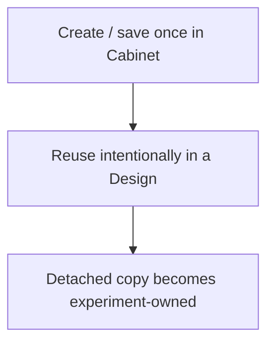

# Lab Cabinet

Lab Cabinet is a browser-local library for reusable laboratory definitions: formulations, device stacks, fabrication recipes, substrates, materials/chemicals, instruments, acquisition software, setups and output file formats.

It is intentionally **not** inventory management, stock control, ERP or a LIMS.

## Mental model

Changing or deleting the Cabinet item later does not rewrite an experiment that already used it.

## What belongs in Cabinet

The highest-value reusable resources are usually:

- formulation/solution definitions;
- complete device stacks;
- fabrication/process recipes.

Materials and substrates support finer Design references. Instruments, acquisition software, setups and file-format profiles form the reusable data-infrastructure catalog referenced by scientific Workspace Processes.

## Design integration

Cabinet never assigns Design fields directly. Application goes through `DesignModel`, which validates/normalizes the copied value and records the Cabinet source reference.

Only Cabinet kinds declaring an applicable Design capability are offered for reuse. The page reads fields, labels, summaries, grouping and capabilities from the Cabinet registry rather than maintaining a second UI-specific schema.

**Add experiment designs to Cabinet** collects reusable formulations, stacks and processes from every accepted/current Design group. It does not read unapplied `design.infer` proposals. A compact review classifies candidates by normalized kind/name/content as **NEW**, **EXACT MATCH**, or **POSSIBLE CONFLICT**. Exact matches default to skip; conflicts require skip, overwrite, or add-as-new. Imported resources retain `experiment_design`, experiment ID, device IDs, and capture timestamps as reference provenance. They remain reusable Cabinet resources, not measurement evidence.

## Validity and AI context

Incomplete resources can remain in Cabinet while being edited. Only resources satisfying the Cabinet validator are eligible for application or bounded AI context.

`design.infer` may receive relevant Cabinet context as “available/reusable lab reference”. It must not treat that context as proof that the current experiment used the item.

## Storage and portability

Cabinet is stored independently from an experiment workspace and can be exported/imported as JSON. Experiment portability remains the responsibility of the normal LabFlow export.

## Data-infrastructure resources

The infrastructure kinds are not copied into Design. They describe reusable components of a data-generating Process:

- `instrument`: instrument type, manufacturer/model, serial/firmware, location and acquisition-software references;
- `software`: acquisition software/vendor/version and supported instruments/formats;
- `setup`: a composed station referencing instruments/software/formats and optional parallel capacity;
- `file_format`: extensions/MIME types, producing software, format documentation, parser support and typical output size/count.

A Workspace Process references these items by stable Cabinet ID. The Process definition is context; a concrete Measurement may additionally record the actual instrument/software/setup references as provenance.

## Cabinet as a Design inference source

Cabinet is the strongest reusable reference source below direct experiment evidence because it represents resources intentionally defined by the researcher for their laboratory. `design.infer` therefore retrieves Cabinet candidates by missing domain and prefers a compatible Cabinet resource over a generic literature archetype.

A Cabinet-backed proposal is labelled `cabinet_reference` and cites `CABINET:<id>`. LabFlow verifies that the ID exists. The proposal remains review-only because “available in this laboratory” is not the same statement as “used in this experiment”.

For small-model robustness, if the provider omits a domain while a valid Cabinet resource already describes it, the deterministic Design fallback may construct the review candidate directly from that resource. This is a **reference copy into a proposal**, not automatic acceptance into scientific Design.

The Design UI exposes the source nature and calibrated confidence so a researcher can distinguish a Cabinet-backed candidate from experiment evidence, a KB archetype or unsupported model inference.
