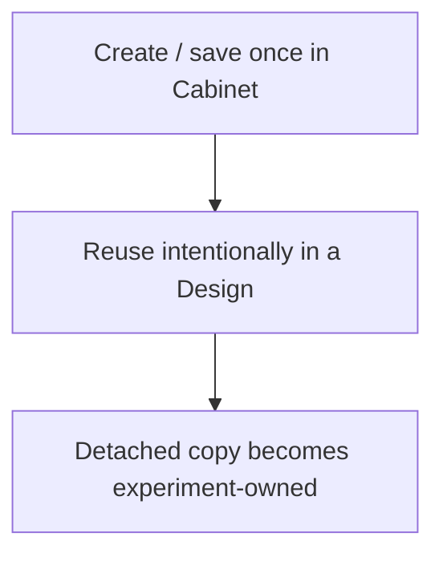

# Lab Cabinet

Lab Cabinet is a browser-local library for definitions you repeatedly use in Design: formulations, device stacks, process recipes, substrates, materials/chemicals and instrument references.

It is intentionally **not** inventory management, stock control, ERP or a LIMS.

## Mental model

Changing or deleting the Cabinet item later does not rewrite an experiment that already used it.

## What belongs in Cabinet

The highest-value reusable resources are usually:

- formulation/solution definitions;
- complete device stacks;
- fabrication/process recipes.

Materials, substrates and instruments are available for laboratories that want finer reusable references, but they are not prerequisites for using Cabinet.

## Design integration

Cabinet never assigns Design fields directly. Application goes through `DesignModel`, which validates/normalizes the copied value and records the Cabinet source reference.

Only Cabinet kinds declaring an applicable Design capability are offered for reuse. The page reads fields, labels, summaries, grouping and capabilities from the Cabinet registry rather than maintaining a second UI-specific schema.

## Validity and AI context

Incomplete resources can remain in Cabinet while being edited. Only resources satisfying the Cabinet validator are eligible for application or bounded AI context.

`design.infer` may receive relevant Cabinet context as “available/reusable lab reference”. It must not treat that context as proof that the current experiment used the item.

## Storage and portability

Cabinet is stored independently from an experiment workspace and can be exported/imported as JSON. Experiment portability remains the responsibility of the normal LabFlow export.
