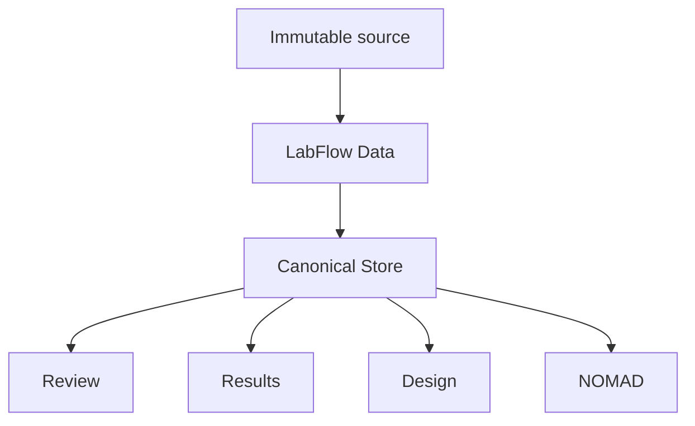

# Research workflow

The workflow is intentionally linear and uses one shared experiment state.

| Step | Researcher goal | Authoritative owner | AI role |
|---|---|---|---|
| Upload & Review | Inspect source evidence and corrections | LabFlow Data + deterministic findings | optional semantic enrichment / ambiguity proposals |
| Results | Evaluate measurements and rankings | deterministic analysis | optional interpretation only |
| Design | Complete solution chemistry, device architecture and fabrication process | researcher-confirmed Design | suggestions for missing fields |
| Export | Save LabFlow and prepare NOMAD artifacts | deterministic LabFlow/NOMAD export services | optional explanation or semantic-resolution Actions only |

## One state, several projections

Pages do not own separate scientific copies. A reviewed change to the LabFlow Data is therefore visible wherever that field matters.

## Upload & Review

The first step establishes provenance and current data quality. Import is deterministic-first and remains usable without AI.

Review distinguishes mechanically safe deterministic corrections from ambiguous interpretations. Safe corrections are detected automatically but remain pending until **Accept safe cleanup**; acceptance changes only LabFlow Data, writes provenance, and immediately reruns the deterministic pipeline. Apply only changes whose evidence and target you understand.

## Results

Results reuse deterministic calculations from the current revision. Filters and charts change the view, not the underlying measurements. AI interpretation is read-only prose layered over these values.

## Design

Design is directly editable. AI suggestions are optional proposals and never silently overwrite known fields.

Bulk suggestion is sequential/bounded. A provider throttle stops the sequence immediately and preserves completed proposals instead of converting every remaining experiment into an error.

## Export / NOMAD

Export keeps the LabFlow ZIP as the primary portable save. The current Canonical Store is mapped deterministically to NOMAD for secondary entry/staging artifacts. Required missing mappings block readiness, and every blocker must expose a concrete remediation path. Changes to relevant scientific data or package options invalidate stale staging. A direct **Upload to NOMAD** surface is present only as a clearly labelled stub: it sends nothing. Future endpoint/account/token values are configured separately in Settings and retained locally.

## Save, autosave and export

**Autosave** provides browser recovery through IndexedDB. **Save** marks an explicit checkpoint revision. **Export ZIP** creates a durable LabFlow package.

Derived PDF/DOCX/NOMAD exports do not overwrite the source ZIP and do not silently mark later LabFlow Data edits saved.
