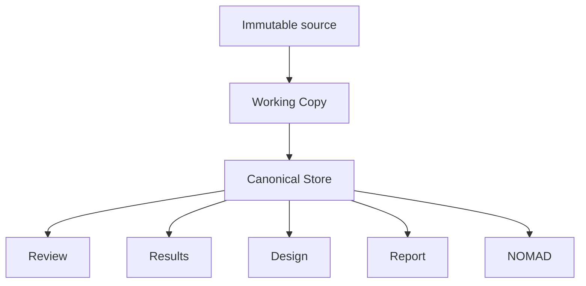

# Research workflow

The workflow is intentionally linear and uses one shared experiment state.

| Step | Researcher goal | Authoritative owner | AI role |
|---|---|---|---|
| Upload & Review | Inspect source evidence and corrections | Working Copy + deterministic findings | optional semantic enrichment / ambiguity proposals |
| Results | Evaluate measurements and rankings | deterministic analysis | optional interpretation only |
| Design | Complete solution chemistry and device stack | researcher-confirmed Design | suggestions for missing fields |
| Report | Write Lab Report / Scientific Paper | current Markdown editor | bounded drafting/editing |
| NOMAD | Validate and package experiment metadata | deterministic Canonical → NOMAD mapping | explanation only, never readiness |

## One state, several projections

Pages do not own separate scientific copies. A reviewed change to the Working Copy is therefore visible wherever that field matters.

## Upload & Review

The first step establishes provenance and current data quality. Import is deterministic-first and remains usable without AI.

Review distinguishes safe deterministic corrections from ambiguous interpretations. Apply only changes whose evidence and target you understand.

## Results

Results reuse deterministic calculations from the current revision. Filters and charts change the view, not the underlying measurements. AI interpretation is read-only prose layered over these values.

## Design

Design is directly editable. AI suggestions are optional proposals and never silently overwrite known fields.

Bulk suggestion is sequential/bounded. A provider throttle stops the sequence immediately and preserves completed proposals instead of converting every remaining experiment into an error.

## Report

Report and Paper are separate documents with independent Markdown and figure selections. The editor is the textual source of truth. Export renders the current text; it does not ask AI to regenerate it.

## NOMAD

The current Canonical Store is mapped deterministically to NOMAD. Required missing mappings block readiness. Changes to relevant scientific data invalidate stale staging.

## Save, autosave and export

**Autosave** provides browser recovery through IndexedDB. **Save** marks an explicit checkpoint revision. **Export ZIP** creates a durable LabFlow package.

Derived PDF/DOCX/NOMAD exports do not overwrite the source ZIP and do not silently mark later Working Copy edits saved.
