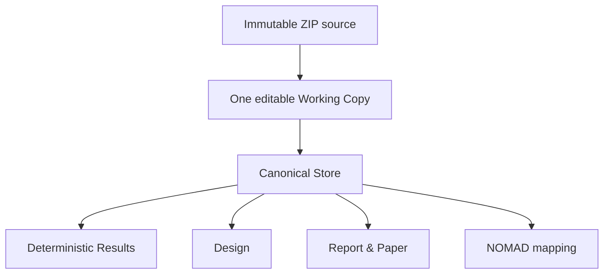

# Research workflow

The workflow is intentionally linear. Each step reads the same Working Copy and adds a reviewed result without creating a second scientific state.

| Step | Researcher goal | Authoritative owner |
|---|---|---|
| Upload & Review | Inspect source evidence and corrections | Working Copy + deterministic findings |
| Results | Evaluate measurements and rankings | Deterministic analysis |
| Design | Complete solution chemistry and device stack | Researcher-confirmed Design |
| Report | Write the current laboratory report or paper | Markdown editor |
| NOMAD | Validate and package the experiment | Canonical → NOMAD mapping |

## Source and Working Copy

The Canonical Store is a semantic index over the Working Copy. It adds stable identities, aliases, relations, and compact evidence references; it is not another editable experiment.

## Review decisions

LabFlow separates deterministic findings, safe corrections, AI ambiguity proposals, and unresolved questions. AI proposals are never applied silently. Code validates every proposal target before the researcher can apply it.

## Save and export

**Autosave** restores the current browser-local Working Copy. **Save** marks an explicit checkpoint. **Export ZIP** creates a durable package. Report, Paper, and NOMAD exports are derived artifacts and never overwrite the original ZIP.

