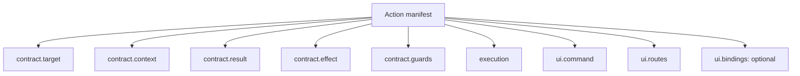
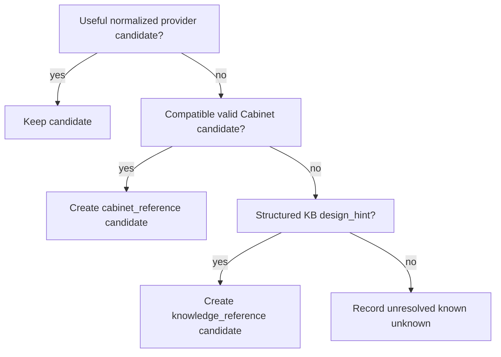

# Actions

An Action is a researcher-facing capability with an explicit target, bounded context, semantic result and declared state effect. Actions are not a generic wrapper around internal functions.

## Current public catalog

| Action | Purpose | Result authority |
|---|---|---|
| `dataset.resolve-ambiguities` | propose resolutions for semantic review ambiguity | proposal |
| `design.infer` | propose missing qualitative Design content for one experiment | proposal |
| `export.prepare` | prepare missing export metadata as reviewable projection overrides | proposal |
| `results.interpret` | explain deterministic Results | derived annotation |
| `results.compare` | compare selected deterministic result groups | derived annotation |
| `assistant.chat` | answer from bounded current context | read-only answer |

Safe cleanup, JV analysis, indexing and NOMAD package generation remain deterministic services. `export.prepare` is an Action only because it proposes reviewable metadata wording/values for missing export projection fields; it never builds or uploads the package itself.

## Manifest

`actions/<id>/action.json` is the executable source of truth. A public Action declares:

Prompt Markdown and structured-result JSON Schema live beside the manifest when needed.

## Capability preflight

`ActionCapabilities` resolves UI bindings and guards for every surface. Public Actions remain globally discoverable; the current route may mark them recommended but does not make them exist/disappear.

The Runner resolves/re-checks the same capability at execution time so stale UI state cannot bypass a guard.

## Execution

An Action run has one active runtime record, bounded steps, bounded retry policy, provider deadline where applicable, and a declared semantic result step. HTTP success is only transport success. The run succeeds only when the semantic result is produced and validated.

## AI structured output

For JSON Actions:

1. build bounded deterministic Context Pack;
2. call the configured provider;
3. parse/normalize structured output;
4. validate JSON Schema;
5. run optional semantic validator;
6. perform at most the manifest-defined semantic retry;
7. store only the validated result through the owner step.

A malformed, truncated or semantically rejected response remains a failed/retryable Action result; it is never stored as success.

## Effects

Actions may write `ActionData`, interaction history, or call a deterministic owner-controlled apply operation after explicit user acceptance. They do not directly mutate arbitrary scientific roots.

## Bulk operations

A bulk UI operation should sequence the same single-target Action when each target is independently reviewable. `Complete all missing with AI` therefore runs `design.infer` per experiment instead of inventing a second batch semantic contract.

Completed targets remain stored if a later target fails. Rate limiting stops future requests rather than creating hidden background retries.

## Internal Action-step tools

Manifest execution may use deterministic read/write tools registered through the tool/action-step registries. These are implementation capabilities and must not appear as separate researcher Actions.

## Extending

To add an Action, create its directory, define the manifest, add prompt/schema only when required, implement deterministic context/tool support, rebuild registries/references, and add contract/behavior tests. Do not add an Action-ID switch to the Assistant or pages.

## `design.infer` semantic contract

`design.infer` is unusual because a valid result can contain a mix of evidence-backed values, reusable references, qualitative inference and explicit unknowns. The semantic validator therefore operates on the **normalized proposal**, not on raw provider text.

For each requested domain (`solutions`, `stack`, `process`) the runtime performs:

The deterministic fallback uses only content already present in bounded reference context. It does not perform free-form scientific invention. `validation.referenceFallbackDomains` records domains supplied by this path; `validation.autoUnresolvedDomains` records domains that had to be downgraded to unresolved because neither provider output nor supplied references were sufficient.

The provider may report confidence, but LabFlow calibrates it from provenance before UI display/application decisions. See `guides/DESIGN_INFERENCE.md`.

## Export preparation transport normalization

`export.prepare` keeps a strict semantic schema, but LabFlow canonicalizes harmless provider-shape noise before schema validation. In particular, `value: null` on an `unresolved` item is discarded because unresolved fields have no export value. Common casing/alias variants for projection, field id and source kind are normalized. This repair never synthesizes scientific metadata or converts an unresolved field into a suggestion.

