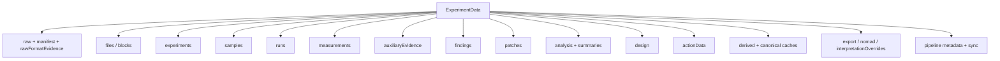
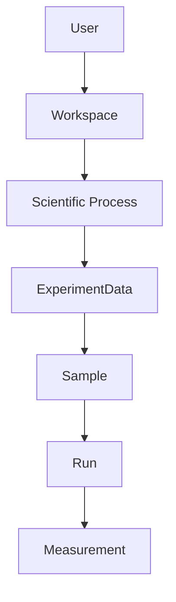
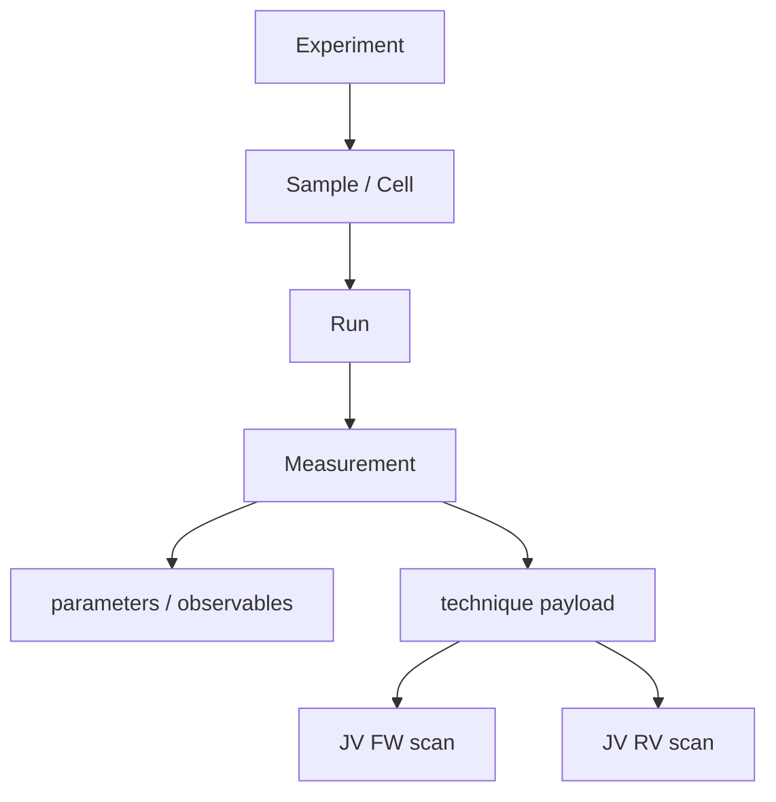

# Scientific data model

## Aggregate root

`ExperimentData` is the only mutable scientific aggregate in LabFlow. Every scientific page, deterministic calculation, Action context and export projection reads the same aggregate.



This is a readable subset. `DomainSchema` is the executable authority and currently registers 29 roots, including runtime caches and export/interpretation state. The root key holding RAW identity is `raw` (not `source`).

The exact current root contract is executable in `DomainSchema`; prose describes semantics and ownership rather than duplicating every default value.


## Workspace and Process context

`ExperimentData` remains the only mutable scientific aggregate, but it is now linked to a separate browser-local scientific `Workspace` that describes the **data-generating environment**. This avoids duplicating laboratory infrastructure and responsibility metadata inside every experiment.



A Workspace owns institution, role-based contacts, reusable locations, storage profiles and Process definitions. A Process describes one measurement/characterization/simulation/fabrication workflow: sample types, controlled variables, observables, locations, instruments, acquisition software, setups, output formats, typical frequency/size/capacity and sample-metadata/linkage policy.

`Process` is deliberately distinct from `design.devices[].process`: the latter remains the fabrication/process description of one experiment Design.

Experiments store only stable `workspaceId` and `processId` references in `meta`. Export packages may include a redacted Workspace snapshot; contact names and email addresses are excluded from scientific portability snapshots by default.

## Acquisition hierarchy



Relations use stable LabFlow IDs. Source file paths remain provenance and may participate in evidence lookup, but file identity is not sample identity.

## Record construction

Canonical record defaults are created by `DomainSchema`. Importers and features must not reproduce record literals as independent definitions. Normalization may fill canonical structural defaults; it must not fabricate missing scientific evidence.

## Root ownership

Use `LabFlow.Data.ownership()` for the live owner/layer/persistence table. The important boundary is:

- import/source roots: importer/parser during canonical construction;
- scientific/analysis roots: domain services and deterministic pipeline;
- `design`: `DesignModel`;
- corrections/patches: `DatasetCorrections`/model commit path;
- `actionData`: `ActionData`;
- runtime projections/caches: owning derived service;
- UI state: outside the aggregate under `LF.State.state.ui`.

## RAW versus LabFlow Data

RAW is immutable source evidence. LabFlow Data is the reviewed interpretation/model derived from it.

A correction changes LabFlow Data, not RAW. The correction is represented as a typed patch/provenance event so a reviewer can distinguish original evidence from interpretation changes.

## Persistence

`DomainSchema.snapshot()` defines which aggregate roots persist. `DataModel.serialize()` produces the application snapshot. Runtime caches and UI state are excluded unless explicitly declared persistent by their owners.

External/browser-persisted snapshots are untrusted input and must enter through `DataModel.restore()`, which validates the current snapshot contract before hydration. LabFlow intentionally does not maintain an open-ended migration ladder for obsolete POC shapes.

`DataModel.hydrate()` is for runtime objects already owned by the current application. It is not a permissive import path.

## Revision and invalidation

Scientific mutation advances revision through owner/model APIs and invalidates dependent projections. Derived projections register dependencies with `DerivedState`; they do not rely on pages remembering which caches to clear.

## Action output

AI/user Action output is not inserted directly into scientific measurements or Design. Proposals/annotations/status live in `actionData` until an explicit deterministic apply path accepts a proposal into the owning scientific domain.

## Measurement generalization

A Measurement has a generic scientific envelope (`technique`, `parameters`, `observables`, setup/instrument/software/location references and sample-linkage evidence) while retaining current JV-specific FW/RV fields for compatibility with deterministic JV analysis. Importers may populate technique-specific payloads without making the root hierarchy technique-specific.

`parameters` are acquisition conditions/settings; `observables` are recorded or derived quantities. Unknown vendor/parser fields may remain in `meta`, but stable scientific concepts should be promoted to explicit fields.

## Cabinet and Knowledge Base

Cabinet and KB are outside `ExperimentData` because they are reusable/reference state with different lifecycle and authority.

When Cabinet content is applied to Design, a detached value snapshot becomes experiment-owned Design state and retains a source reference. KB content never becomes experiment evidence merely because it was retrieved for AI context. Design proposals may record `knowledge_reference` provenance with an exact `KB:<id>` evidence marker. If no useful qualitative candidate can be responsibly established even after experiment/Cabinet/KB/model context, the proposal records the domain in `unresolved_domains` instead of fabricating a value. Researcher acceptance persists those domains on the Design device as reviewed known unknowns (`acknowledgedUnknownDomains` plus notes): they remain scientifically missing but stop being pending AI work until the corresponding domain is edited.

## Structure catalog

`LF.Structures` documents cross-module shapes without owning them. Use:

```js
LabFlow.Data.structures()
LabFlow.Data.structures({ owner: 'Cabinet' })
```

Adding metadata to the catalog does not change persistence or validation; those remain owner responsibilities.


### Conservative Design coverage fallback

For `design.infer`, a syntactically valid response does not fail merely because a required Design domain was omitted or represented by an unusable partial candidate. LabFlow owns the deterministic requested-domain scope: after normalization, any required domain that is neither usefully populated nor explicitly unresolved is deterministically downgraded to an auditable unresolved known-unknown. Incomplete candidate content for that domain is discarded so it cannot be applied accidentally. This fallback adds no scientific facts and is intended to make small and large models behave consistently without encouraging fabrication.

## Design proposal provenance metadata

Review proposals preserve metadata that explains **why a candidate exists**, without making that metadata a second scientific truth store:

- `provenance_kind` — `experiment`, `cabinet_reference`, `knowledge_reference`, `model_inference`;
- `evidence` — current-experiment evidence text or exact `CABINET:<id>` / `KB:<id>` marker;
- `selection_basis` — human-readable nature of the choice;
- `reported_confidence` — model/reference confidence before LabFlow calibration when available;
- `confidence` — provenance-calibrated candidate confidence;
- `confidence_basis` — explanation of what the calibrated value represents;
- `field_decisions[]` — per-field source, confidence, quantitative flag and automatic/review decision;
- `validation.referenceFallbackDomains` — domains built deterministically from supplied references;
- `validation.autoUnresolvedDomains` — domains conservatively downgraded to known unknowns.

This metadata belongs to the proposal/review lifecycle. Only accepted Design values become experiment-owned Design state, carrying appropriate detached provenance snapshots/references through `DesignModel`.
